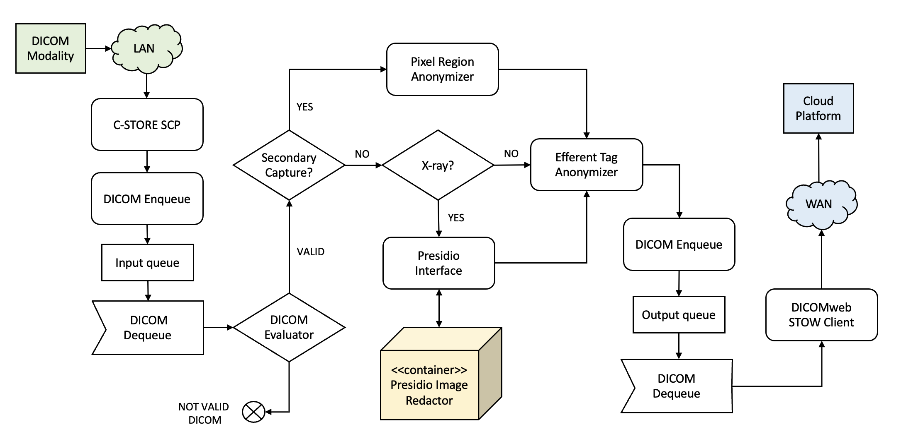

<br/>

# Knowledge Base Article

```
Product Name:  eVue and SmartLink
Article Topic: DICOM Images anonymization and de-identification
Last Update:   June, 2024
```

## Table of Contents

1. [Description](#description)
2. [High Level Review](#high-level-review)
3. [Tool Set](#tool-set)
2. [Usage in eVue](#usage-in-evue)
3. [Usage in SmartLink](#usage-in-smartlink)

## Description

The following article describes the anonymization and de-identification features in Efferent eVue application and SmartLink device.

## High Level Review
Efferent Health uses several software tools for protecting the patient privacy, using with the following mthods:

- **Anonymization**, ensures that personal data cannot be traced back to the individual under any circumstances, providing the highest level of privacy protection.
- **De-identification**, allows for the possibility of re-identifying individuals under controlled conditions, balancing privacy with data usability.

The tools comprise several open-source libraries, including those developed in-house.

## Tool Set

All the tools described here are based on Microsoft technologies and most of them published as open-source code in gitbuh.com

### fo-dicom anonymizer

Efferent Health is a key contributor in the [fo-dicom](https://github.com/fo-dicom/fo-dicom) project, then most important open-source .NET library for manipulating DICOM files.

The initial proposal was posted in January 2017 (read: https://github.com/fo-dicom/fo-dicom/issues/410), and was based on the [DICOM Supplement 142, 2011](ftp://medical.nema.org/medical/dicom/2011/11_15pu.pdf).

The standard's suplement describes a method for de-identifying DICOM tags based on _confidentiality profiles_, and proposed a Basic Profile, that is used in the fo-dicom's _DicomAnonymizer_ class implementation.

Apart from the Basic Profile, it is possible to define custom profiles by enlisting a set of DICOM tags and de-identification action.

Efferent is working on improving this library to cover the [final version](ftp://medical.nema.org/medical/dicom/final/sup142_ft.pdf) of the Supplement.

### Efferent Pixel Region Anonymizer

A private Efferent SDK allows to blank well-known regions of an image give a couple of coordinates. This simple feature is uselful for cases like secondary capture, where the text is rendered in the same position, typically atop of the screenshot.

### Microsoft Presidio Image Redactor

_Image Redactor_ is a component which is part of Microsoft's [Presidio](https://github.com/microsoft/presidio) Data Protection and De-identification SDK. 

The tool is a Python based module for detecting and redacting PII text entities in images, and can be wrapped as a Docker container for easy integration.

Efferent Health also has a AI-based redaction library for images built in-house, but decided to give priority to Microsoft's solution.

### Microsoft Tools for Health Data Anonymization

As part of this tool set published in [github](https://github.com/microsoft/Tools-for-Health-Data-Anonymization
), Microsoft offers an open-source application for anonymization of DICOM files' metadata, that Efferent has re-wrapped as a service inside a Docker container.

Unlike Efferent/fo-dicom's library, Microsoft offers more anonymization actions beyond the standard, like encryption hashing, perturbance, and date-shifting. This library can also anonymize FHIR records.

On the other hand, this library presents some limitations like the inability to anonymize nested tags, or a complex group of tags.

## Usage in eVue

Currently, Efferent eVue's upload option uses fo-dicom for anonymizing studies using the Basic Profile, as described in the standard.

## Usage in SmartLink

SmartLink provides all the mentioned options for anonymization, to be enacted in its Workflow Engine as Worfklow Activities. 

The first one (fo-dicom) is implemented as a standard Workflow Engine activity, with the possibility of supplying a modified or alternative anonymization profile.

The Pixel Region Anonymizer is also embedded into a native activity in SmartLink's Workflow Engine, with the possibility of specifying several rectangular regions.

The two Microsoft anonymization tools (Presidio and Health Data Anonymization) are delivered as web services inside Docker containers and interfaced with a corresponding Workflow Activity.

The following diagram depics a realistic workflow using three anonymization methods for DICOM, depending on the image type. This workflow is configured and enacted by SmartLink device.

