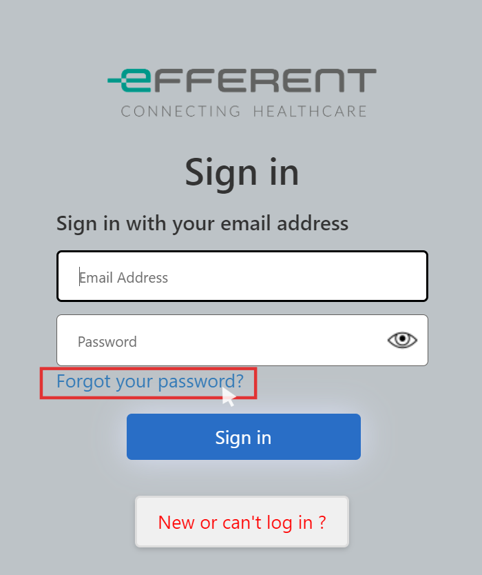
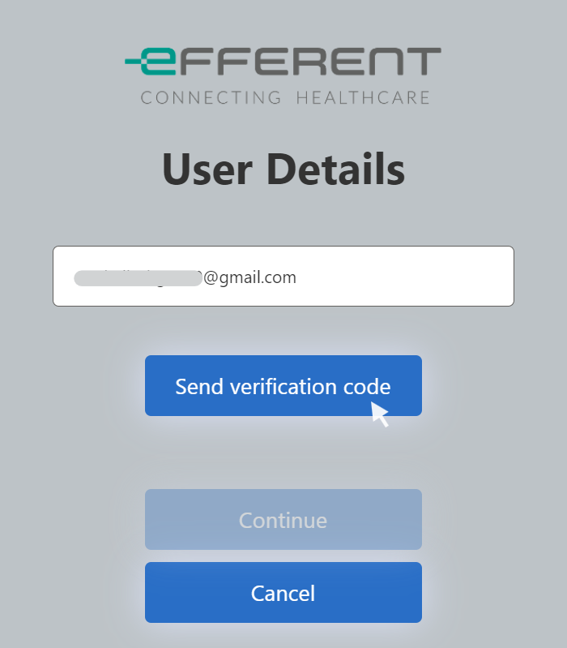
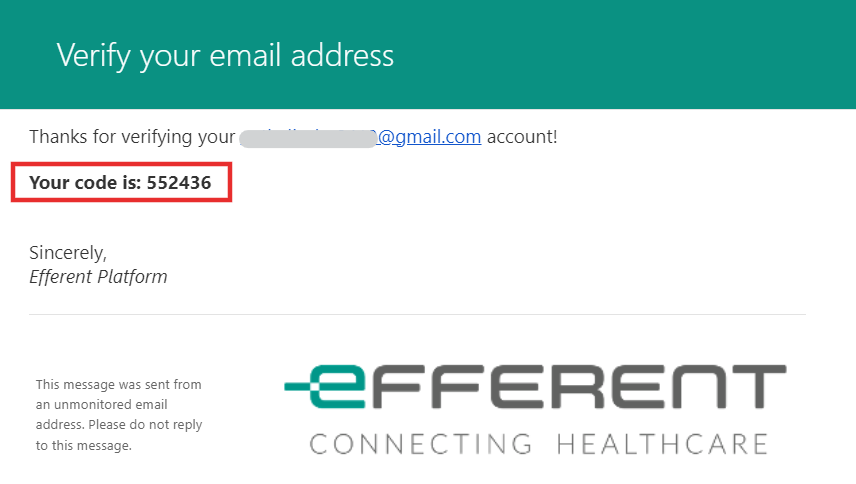
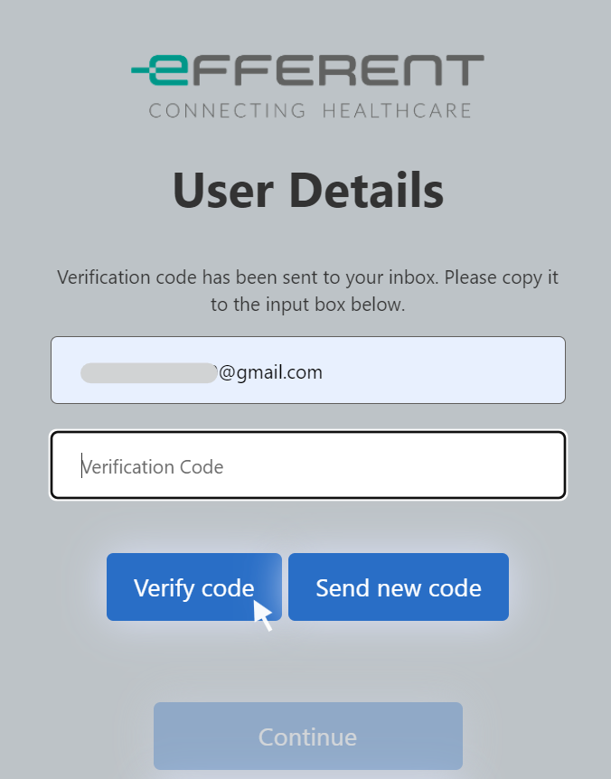
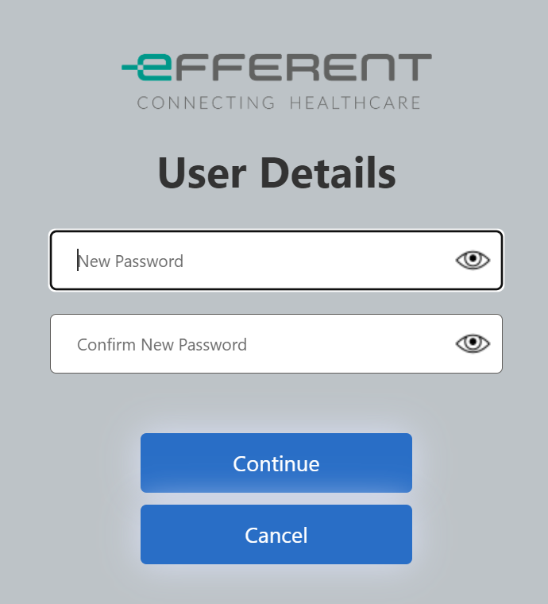
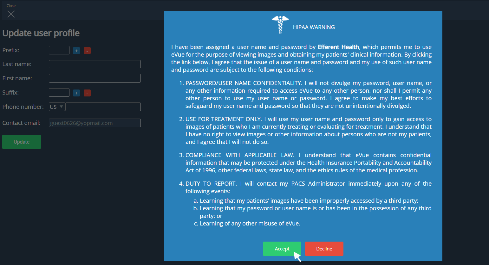
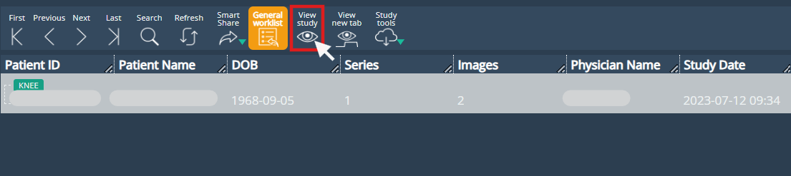

<br/>

# Knowledge Base Article

```
Product Name:  eVue
Article Topic: SmartShare receiver
Last Update:   June, 2024
```

## Description

The following article describes step-by-step how to enable an invited user to see a shared Efferent radiology study.

## Steps

### Step 1 
Access the email link that was sent to you from Efferent Notifier. If the email is not displayed, look in spam or junk mail folder and move it to the main inbox. The email will be similar to the welcome email below.


 
### Step 2

Follow the link to begin to set up your Account.
 
### Step 3

Enter your email address and password.

If this is the first time accessing the Efferent Platform to view images, select ‘FORGOT YOUR PASSWORD?’.



### Step 4

Enter your email address and click on Send verificaton code. 



An e-mail with a verification code will be sent.  



Paste this code in the corresponding field and select Verify code. Then click on Continue.



Enter a new password and confirm it in the New Password fields.  Then select Continue.  
Remember that the password requires at least 8 characters, of which 1 must be a number and 1 must be a special character (@ $ ! ! % * ? ? & - #_ ). An example password would be Casper01!
 


### Step 5

Accept the HIPAA warning message. Proceed and create a profile. You will then be logged into eVue and should see the study.
 


### Step 6
 
 If it is a patient account, a general worklist will be displayed. To view the images, double click on the record or select it and click the View Study button.
 

 
To view the study after logging out of eVue, log back in using: 
https://platform.efferenthealth.net

Enter the user credentials (email address) and password.


---

If you need further assistance, please contact Efferent Support @ (888) 805-5036