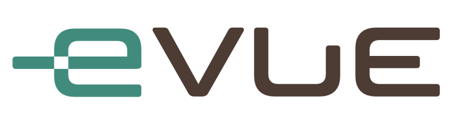

# eVue Features per Role

## Role descriptions

### Organization Admin
This role has access to every available feature in eVue, especially those that may alter DICOM files and other user privileges.

### Organization Practitioner
This is the most common role, for all kind of healthcare practitioners (physicians, techs, admins) and allows to use most of the features of eVue, with exception of admin-exclusive functions.

### Global Reader
This role enables navigation through studies across all the organizations within an environment. It has access to most eVue features, except for functions reserved for admins.

### Guest Practitioner
A guest practitioner is one invited by an admin or organization practitioner to use eVue to review a specific record. Features that may alter or add information to medical records are restricted.

### Patient
Patients are highly restricted to only view and share their own medical records, without any advanced feature intended for practitioners.

### Anonymous
Anonymous users are those who have received a medical record link via QR Code or Teams chat. As they are not identified, they have the most limitations on viewing that record.

## Feature management 

### Application Tags
Application tags are modifiers that allows an admin to enable or disable certain features for specific users, in case they are available at organization level.

### Extensions
Extensions are intended to enable third-party applications, typically as toolbar buttons. Efferent only uses this feature for the reporting toolset.

## Worklist View

Feature|Org. &numsp;Admin&numsp;|Org. Practitioner|Global &numsp;Reader&numsp;|Guest Practitioner|&numsp;Patient&numsp;|Anony- mous|App&numsp;Tag?|Extension?
--|:--:|:--:|:--:|:--:|:--:|:--:|:--:|:--:|
Filter|&#x2713;|&#x2713;|&#x2713;|&#x2713;|||||
Search|&#x2713;|&#x2713;|&#x2713;|&#x2713;|&#x2713;||||
Tags|&#x2713;|&#x2713;|&#x2713;||||||
SmartShare|&#x2713;|&#x2713;|&#x2713;|&#x2713;*|&#x2713;*||&#x2713;&sect;||
Download (As zip package/as ISO file)|&#x2713;|&#x2713;|&#x2713;|&#x2713;|&#x2713;||&#x2713;|&#x2713;|
Upload (DICOM, MP4, Attach)|&#x2713;|&#x2713;|&#x2713;||||&#x2713;|&#x2713;|
Reset Columns|&#x2713;|&#x2713;|&#x2713;|&#x2713;|&#x2713;||||
Sort|&#x2713;|&#x2713;|&#x2713;||||&#x2713;|&#x2713;|
[Read] auto-tag|&#x2713;|&#x2713;|&#x2713;||||&#x2713;|&#x2713;|
Audit Trail|&#x2713;||||||||
Admin Tools (split, merge, inspect, edit, delete, quarantine, anonymnize)|&#x2713;||||||||
General Worklist|&#x2713;|&#x2713;|&#x2713;||&#x2713;||||
Shared Worklist|&#x2713;|&#x2713;|&#x2713;||||||
Quarantine Worklist|&#x2713;||||||||
Case Worklist|&#x2713;|&#x2713;|&#x2713;||||||
Recycle Bin|&#x2713;||||||||
Global Worklist|||&#x2713;||||||
Send to Pacs (per environment) |&#x2713;|&#x2713;|&#x2713;||||||

_*_ _The role can only share with the option "to practitioner's email"._

_&sect;_ _Configurable option: Share by QR code_

## Imaging Study View

Feature|Org. &numsp;Admin&numsp;|Org. Practitioner|Global &numsp;Reader&numsp;|Guest Practitioner|&numsp;Patient&numsp;|Anony- mous|App&numsp;Tag?|Extension?
--|:--:|:--:|:--:|:--:|:--:|:--:|:--:|:--:|
Transform Tools (zoom, pan, rotate, etc.)|&#x2713;|&#x2713;|&#x2713;|&#x2713;|&#x2713;|&#x2713;||||
Image render options (W/L, invert, sharpen)|&#x2713;|&#x2713;|&#x2713;|&#x2713;||||||
Measure tools|&#x2713;|&#x2713;|&#x2713;|&#x2713;||||||
Quick Print|&#x2713;|&#x2713;|&#x2713;|&#x2713;|&#x2713;|&#x2713;||||
Key Image|&#x2713;|&#x2713;|&#x2713;| | | ||||
Stitch & resect|&#x2713;|&#x2713;|&#x2713;|||||||
Case Study|&#x2713;|&#x2713;|&#x2713;| | | ||||
Related study list|&#x2713;|&#x2713;|&#x2713;|||||||
Quick Compare|&#x2713;|&#x2713;|&#x2713;| | | ||||
Ortho Tools (calibration, Cobb, vertebra, eLign)|&#x2713;|&#x2713;|&#x2713;| | | ||||
Multi-plannar reconstruction (MPR)|&#x2713;|&#x2713;|&#x2713;||||&#x2713;|||
eFit - Implant Surgery planning|&#x2713;|&#x2713;|&#x2713;||||&#x2713;|||
Report|&#x2713;|&#x2713;|&#x2713;| | | ||&#x2713;||
Delete Image|&#x2713;| || | | ||||

## Settings View

### General Settings

Feature|Org. &numsp;Admin&numsp;|Org. Practitioner|Global &numsp;Reader&numsp;|Guest Practitioner|&numsp;Patient&numsp;|App&numsp;Tag?|Extension?
--|:--:|:--:|:--:|:--:|:--:|:--:|:--:|
Platform - SmartLink|&#x2713;|&#x2713;|&#x2713;|||||
Platform - General|&#x2713;|&#x2713;|&#x2713;|&#x2713;|&#x2713;|||||
Report Templates|&#x2713;|&#x2713;|||||&#x2713;|
Practitioners|&#x2713;|||||
Routings|&#x2713;|||||||

### Imaging Study Settings

Feature|Org. &numsp;Admin&numsp;|Org. Practitioner|Global &numsp;Reader&numsp;|Guest Practitioner|&numsp;Patient&numsp;|App&numsp;Tag?|Extension?
--|:--:|:--:|:--:|:--:|:--:|:--:|:--:|
Imaging Study|&#x2713;|&#x2713;|&#x2713;|||||
DICOM - General|&#x2713;|&#x2713;|&#x2713;|||
DICOM - Overlay Text|&#x2713;|&#x2713;|&#x2713;|||
Ortho Tools|&#x2713;|&#x2713;|&#x2713;|||