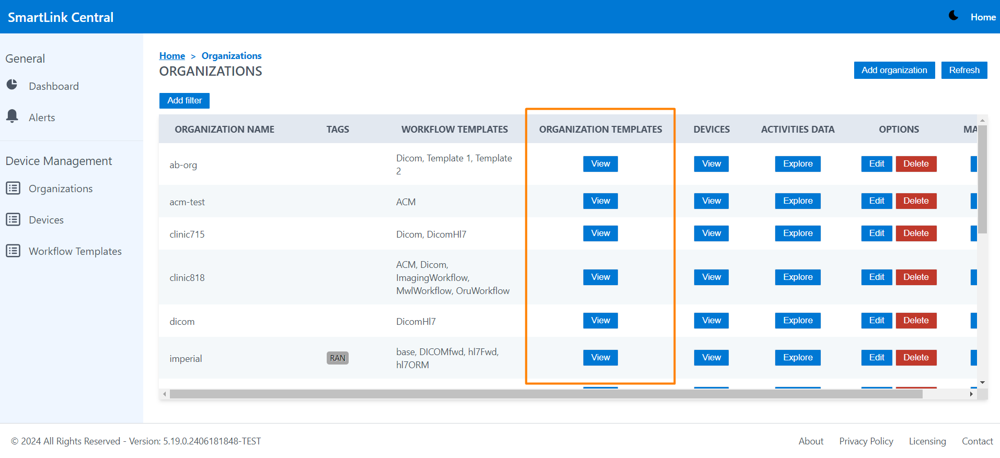
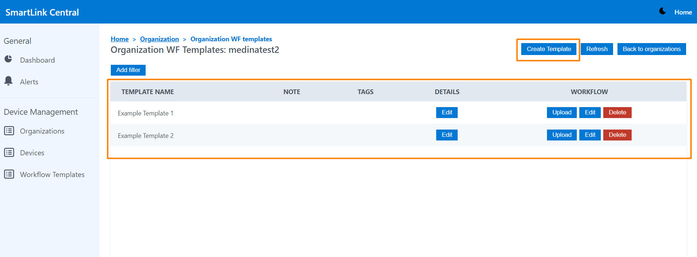
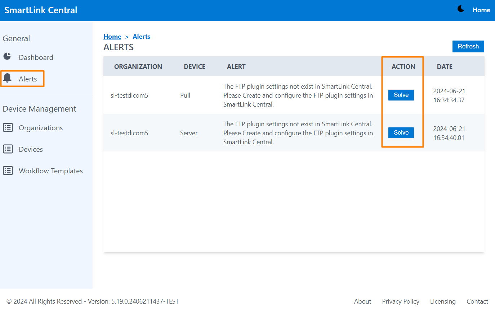
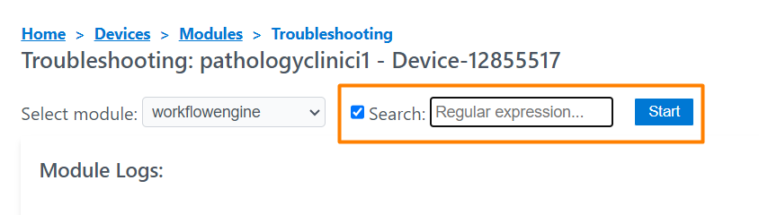
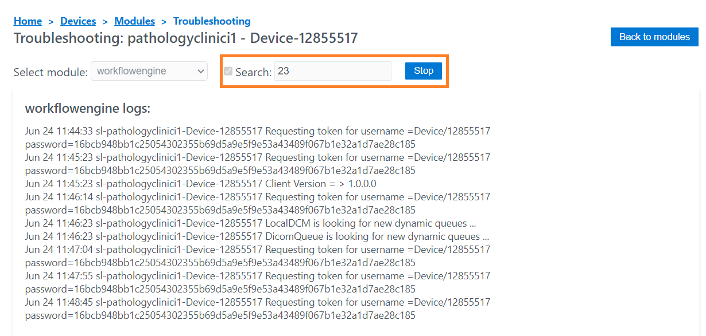

<br/>

# Release Notes

```
Product Name:   Smartlink 5
Version Number: 5.20
Release Date:   May, 2024
```

## Table of Contents

1. [Introduction](#introduction)
2. [New Features](#new-features)
3. [Improvements](#improvements)
4. [Bug Fixes](#bug-fixes)
5. [Deprecations](#deprecations)
6. [Known Issues](#known-issues)
7. [Upcoming Features](#upcoming-features)

## Introduction

Welcome to the June, 2024 release of Smartlink 5. In this update, we've focused on adding new functionalities in SmartLink Central.

## New Features

### FTP Plugin Settings View

FTP Plugin settings is a view where the user can add 1 or more of the 7 supported settings for the ftpplugin module for the following protocols:
 
**FTP**

- Server mode: An FTP server is created, which will send HL7 files stored in the /opt/ftp/ folder to the workflowengine.
- Pull Mode: A client is created that sends get requests for HL7 files to an external FTPS server, these files are stored locally and then sent to the workflowengine for processing. This mode at the same time is waiting for the oru to be sent by the workflowengine, once received a post is made from the Oru to the external FTP server.

**FTPS**

- Server Mode: An FTPS server is created, which will send HL7 files stored in the /opt/ftps/ folder to the workflowengine.
- Pulll Mode: A client is created that sends get requests for HL7 files to an external FTPS server, these files are stored locally and then sent to the workflowengine for processing. This mode at the same time is waiting for the oru to be sent by the workflowengine, once received a post is made from the Oru to the external FTPS server.

**SFTP**

- Server Mode: An SFTP server is created, which will send HL7 files stored in the /opt/sftp/ folder to the workflowengine.

- Pull Mode: A client is created that sends get requests for HL7 files to an external SFTP server, these files are stored locally and then sent to the workflowengine for processing. This mode at the same time is waiting for the oru to be sent by the workflowengine, once received a post is made from the Oru to the external SFTP server.
- Forward mode: in this mode a listener and a sender is created which will forward files to another SFTP server. Files of any size can be sent.

_FTTP Configuration_


### Workflow Templates by Organization

The creation of workflow templates has been improved by adding the option to create templates by organization. In the previous version, templates created from the workflow templates view were generated as default templates that all organizations could access in the list within the organization editor. With this new option the templates created by the user are added to the Templates list of their organization and can be selected from the settings editor column under the "Org. Templates" section. 

_Workflow Templates column in Organization tab_



_Organization templates list_



_Org. Templates column in the Settings editor_


### Device Alerts

This view has been designed to display alerts when incorrect FTP PLUGIN values are entered. When the alerts are displayed, the user has the direct access to reconfigure those parameters in the ftp PlugIn view by clicking on the Solve button. after modifying the values and pressing save and push, the module will restart and the alert list will be cleared.

_Device Alerts view_



_FTP Plugin Settings view_


## Improvements

### Search button in Realtime log

This enhancement allows real-time log filtering, making it possible to search and display logs that meet specific search criteria. For example, view those log lines, associated with a specific PID, or containing the string MSH.

_Click on the Search checkbox to start_



_Searched value entered_



## Bug Fixes

None

## Deprecations

None

## Known Issues

None

## Upcoming Features

- Workflow templates: Ability to update all SmartLinks in an organization after modifying a workflow template.
- Start/stop buttons to apply to single SmartLinks or all across an organization.

---

Thank you for being a valued user of Efferent. We hope these updates enhance your experience. For any questions or feedback, please contact our support team at support@efferenthealth.com .