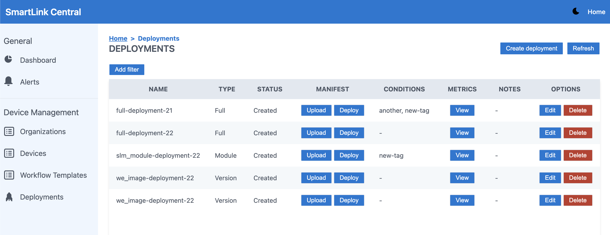
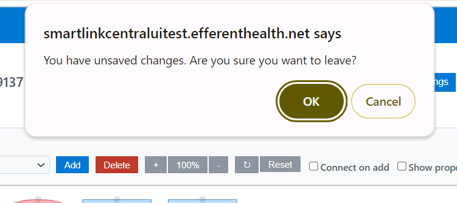
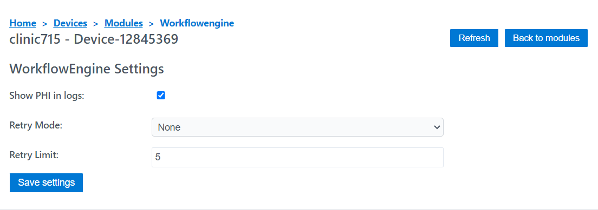
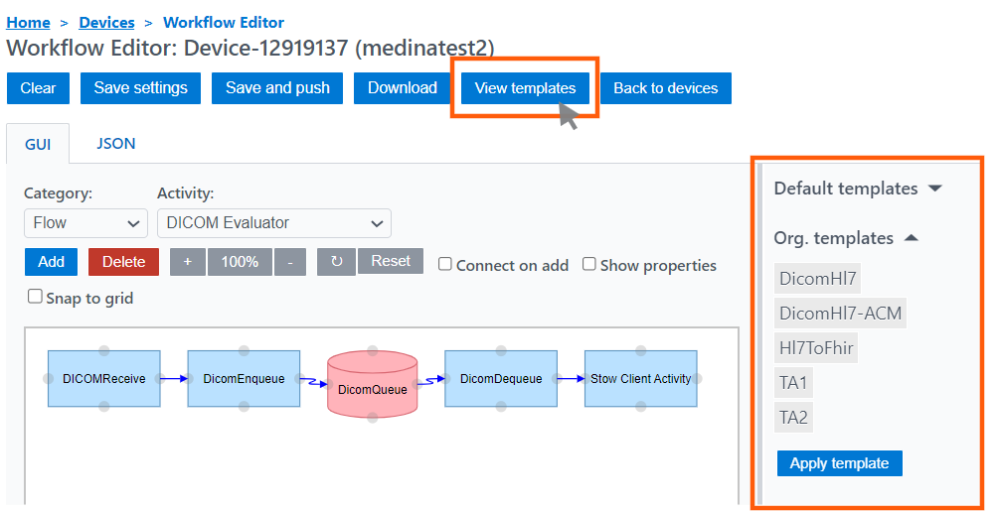
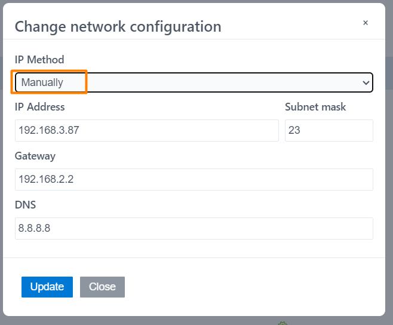
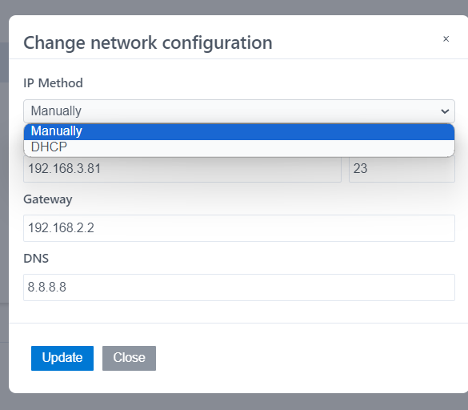
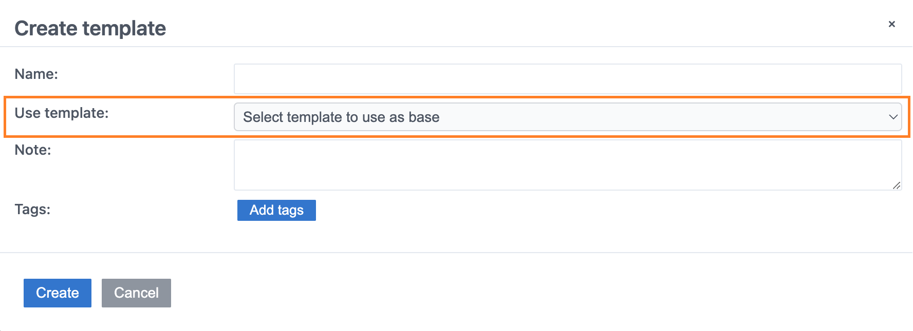
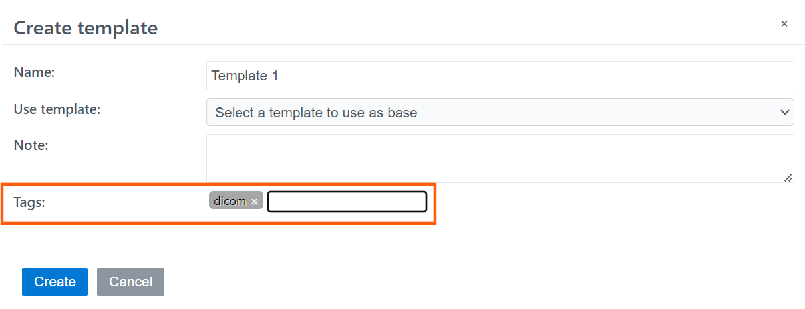
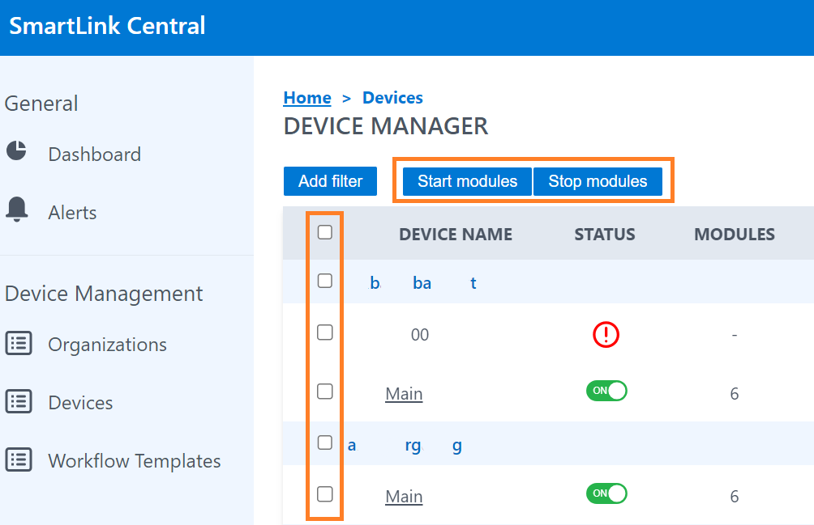
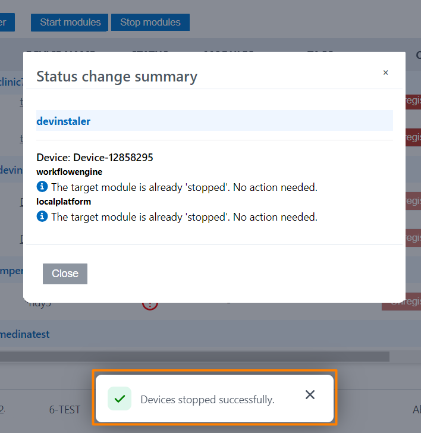

<br/>

# Release Notes

```
Product Name:   Smartlink 5
Version Number: 5.22
Release Date:   July, 2024
```

## Table of Contents

1. [Introduction](#introduction)
2. [New Features](#new-features)
3. [Improvements](#improvements)
4. [Bug Fixes](#bug-fixes)
5. [Deprecations](#deprecations)
6. [Known Issues](#known-issues)
7. [Upcoming Features](#upcoming-features)

## Introduction

Welcome to the July 2024 release of Smartlink 5. In this update, we've focused on adding new functionalities in SmartLink Central and enhancing the user experience.

## New Features

### Deployment View

This feature will display a list of all SmartLink Deployments, as well as provide the option to create a new deployment. It will include the following details for each deployment: Name, Type, Status, Conditions, and Notes.

#### Upload button

This button will allow for simultaneous updating of device manifests, based on user-defined conditions set by organizations or tags. It also supports three types of deployments for a group of devices:

1. Full Deployment: Updates the entire manifest.
2. Module Deployment: Enables updating or adding a module to the current manifest, including Docker configuration, ports, version, and more.
3. Module Version Deployment: Allows updating only the version of a module while retaining its other characteristics.



## Improvements

### Warning when leaving the Workflow editor

A pop-up warning has been added to alert users that they have unsaved changes before exiting the workflow editor.



### WorkflowEngine Settings

In the Devices view, the “Global Settings” column has been removed. These settings were moved to device/$deviceId/modules/$moduleName/settings. It is accessed by selecting a device On Status, and then clicking on Workflowengine.



### Organization templates available when creating a device

In the latest version, the creation of templates by organization has been developed, available in a column within the organization view. In this version, the option to select either default templates or organization templates when creating a new device is available.


### "View templates" reorganization

Improvements were made in the definition of templates by organization and by default. Now, when clicking on the “view templates” button in the workflow editor, two dropdowns appear on the right side of the screen, one for default templates, where all the available templates appear, and a dropdown for organization templates, which are the templates assigned and created for that specific organization.



### Change network configuration 

The option to manually configure the network settings has been enabled. It is now possible to choose between a DCHP or Manual IP input, which allows editing of IP address, subnet mask, Gateway, and DNS. 

_Before_:



_After_:



### Column sort option

We added column sorting option in the Organizations view for the Organizations name column, and in the Workflow templates view for the Template name and Note columns.


### Template bases available for template creation

The option to include base templates when creating new templates has been added. In previous versions, this could only be done after creating the template, in the graphic editor.



### Tags

Tags can now be added when creating or editing devices, organizations, workflow templates, and organization workflow templates. These tags serve multiple purposes.



### Start/Stop modules buttons

In the Devices view of Smartlink Central, Start module and Stop module buttons have been added, along with checkboxes for each device. These buttons allow users to stop all modules of the selected devices, enabling them to be restarted together. The option to restart specific modules is still available in the individual device view.





## Bug Fixes

None

## Deprecations

None

## Known Issues

None

## Upcoming Features

None

---

Thank you for being a valued user of Efferent. We hope these updates enhance your experience. For any questions or feedback, please contact our support team at support@efferenthealth.com .