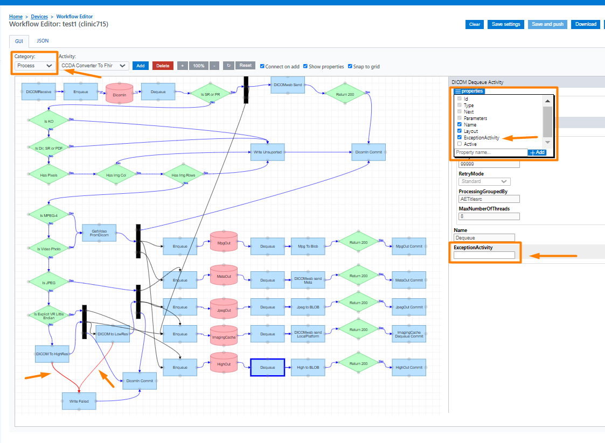
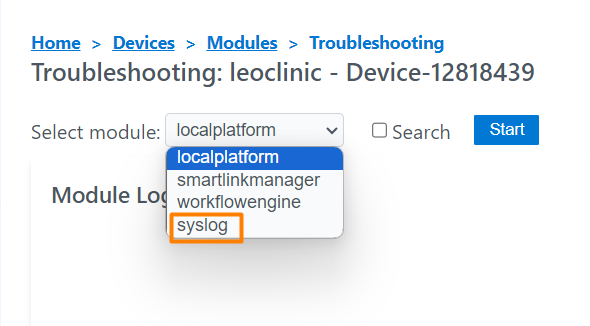
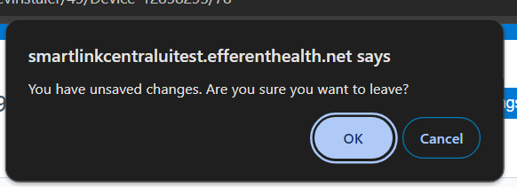
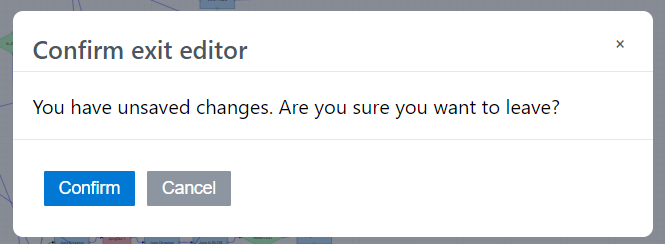
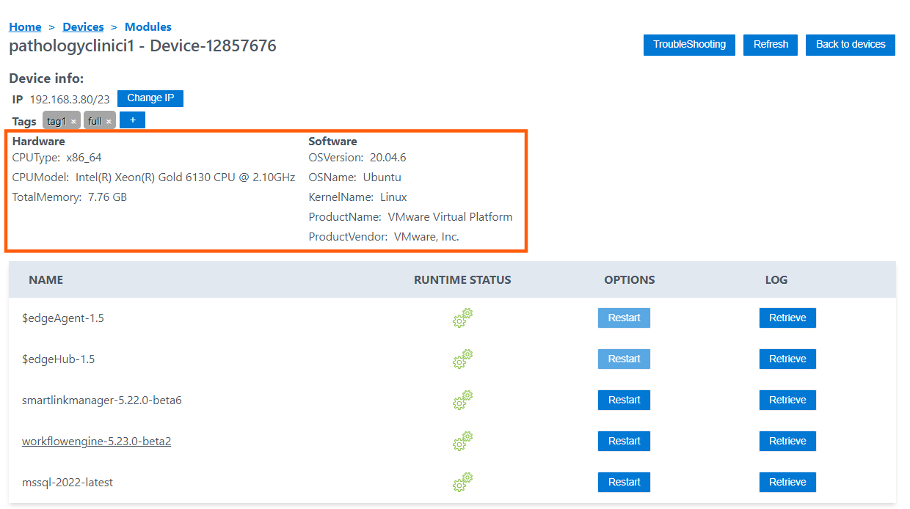

<br/>

# Release Notes

```
Product Name:   Smartlink 5
Version Number: 5.23
Release Date:   August, 2024
```

## Table of Contents

1. [Introduction](#introduction)
2. [Improvements](#improvements)
3. [Bug Fixes](#bug-fixes)
4. [Deprecations](#deprecations)
5. [Known Issues](#known-issues)
6. [Upcoming Features](#upcoming-features)

## Introduction

Welcome to the August 2024 release of Smartlink 5. In this update, we've focused on enhancing the user experience in SmartLink Central.


## Improvements

### Exception Activity Property

A new property has been added that defines an ExceptionActivity inside the Activities. Visually it will be displayed as a red arrow. To add it, select an activity block, open the activity properties and select the ExceptionActivity checkbox. This will show an input text to enter the value.



### System Logs

With this new option in the troubleshooting modules dropdown, the user will be able to access the system logs (syslog) where the logs of all the services running in the operating system (Ubuntu OS) can be reviewed.



### Confirmation dialog to close workflow Editor

A confirmation dialog has been previously implemented when closing the workflow editor to avoid missing the last changes made by the user. In this update the dialog has been adapted to the same style of the web application.

_Before:_



_After:_



### Endpoint for device information

An endpoint has been implemented to access device hardware and software information: cpu, memory, disk, os version, etc. This endpoint returns a Json format with the device data. The deviceID is mandatory.



## Bug Fixes

None

## Deprecations

None

## Known Issues

None

## Upcoming Features

None

---

Thank you for being a valued user of Efferent. We hope these updates enhance your experience. For any questions or feedback, please contact our support team at support@efferenthealth.com .