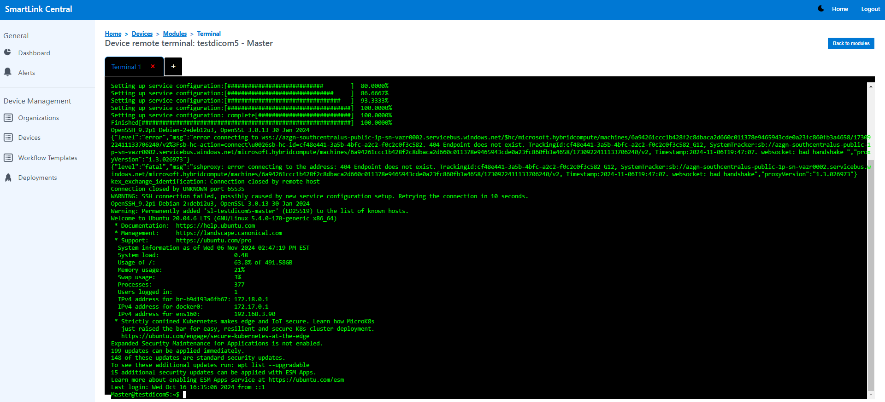
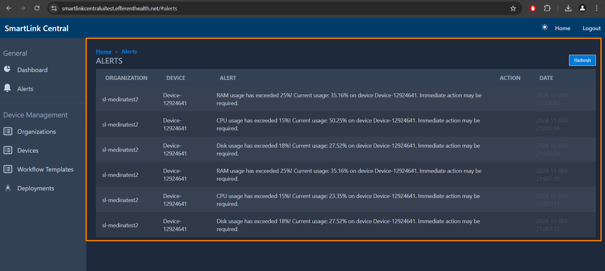
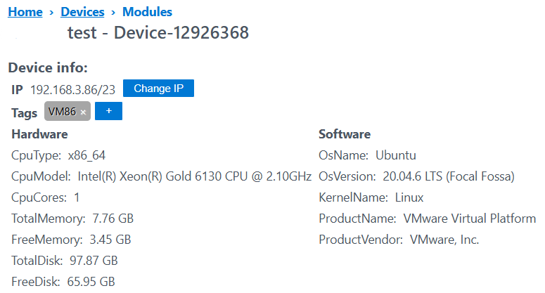
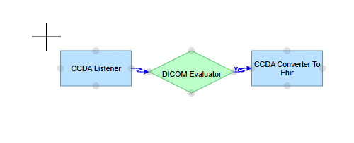

<br/>

# Release Notes

```
Product Name:   Smartlink 5
Version Number: 5.27
Release Date:   December, 2024
```

## Table of Contents

1. [Introduction](#introduction)
2. [New Features](#new-features)
3. [Improvements](#improvements)
4. [Bug Fixes](#bug-fixes)
5. [Deprecations](#deprecations)
6. [Known Issues](#known-issues)
7. [Upcoming Features](#upcoming-features)

## Introduction

Welcome to the December 2024 release of Smartlink 5. In this update, we've focused on enhancing the user experience in SmartLink Central.

## New Features

### Device Terminal

This enhancement allows the user to monitor processes within the device in real-time and perform queries in Smartlink Central.



## Improvements

### Smartlink Maximum Capacity Alert

Alerts were added to notify users when the configured maximum capacity is being reached.



### Deployments View Update

New filter fields have been introduced, along with conditions applied during creation and updates. Additionally, the table buttons and statuses now dynamically update based on user interactions.


### Device Information View Update

The Device Modules View has been updated to display information about the device's total memory, available memory, total disk space, and available disk space. If data for any of these metrics is unavailable, "No information found" will be shown instead.

**Hardware:** CPU Type - CPU Model - Total Memory - Free Memory - Total Disk - Free Disk.

**Software:** OS Version - OS Name - Kernel Name - Product Name - Product Vendor. 



### Reference Center in the Workflow Editor

A cross has been added as a reference center in the workflow editor to more efficiently locate the added activities.



## Bug Fixes

None

## Deprecations

None

## Known Issues

None

## Upcoming Features

None

---

Thank you for being a valued user of Efferent. We hope these updates enhance your experience. For any questions or feedback, please contact our support team at support@efferenthealth.com .