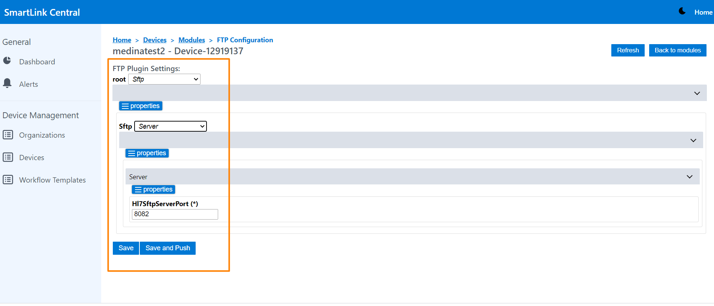
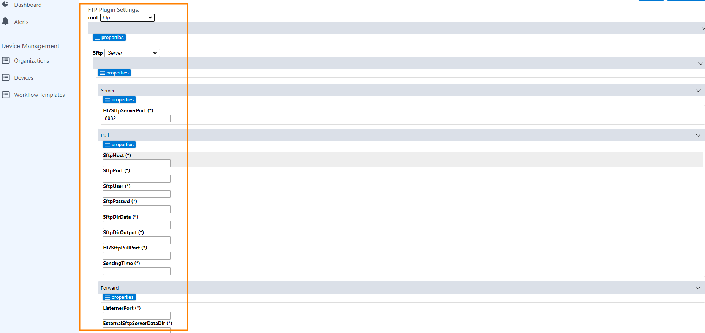
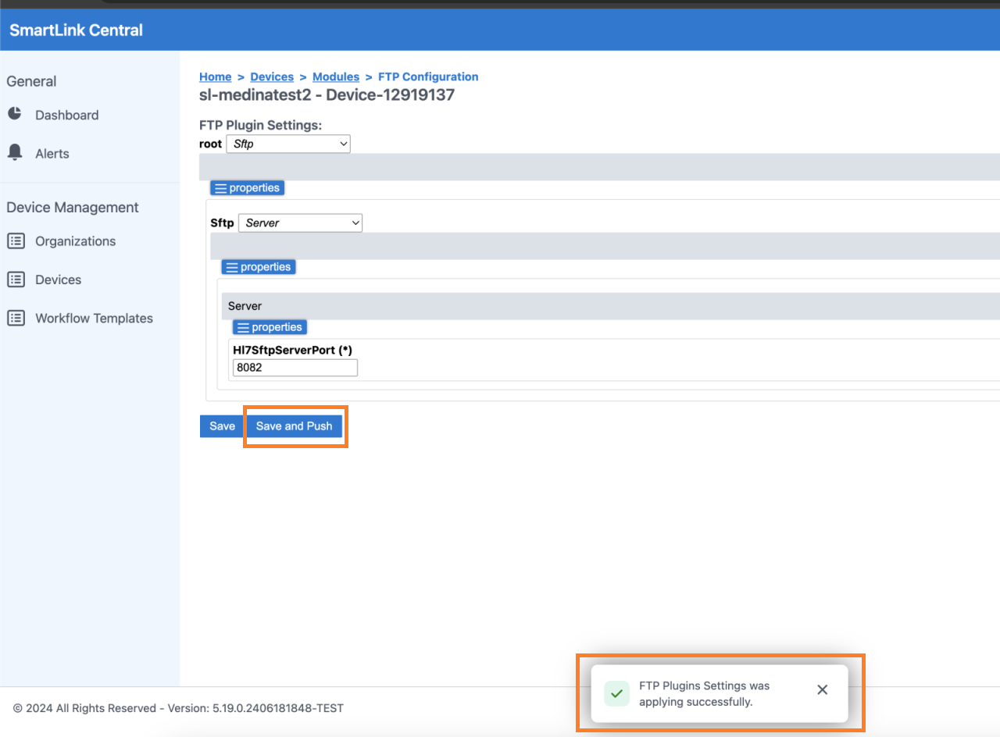

<br/>

# Release Notes

```
Product Name:   Smartlink 5
Version Number: 5.20
Release Date:   May, 2024
```

## Table of Contents

1. [Introduction](#introduction)
2. [New Features](#new-features)
3. [Improvements](#improvements)
4. [Bug Fixes](#bug-fixes)
5. [Deprecations](#deprecations)
6. [Known Issues](#known-issues)
7. [Upcoming Features](#upcoming-features)

## Introduction

Welcome to the June, 2024 release of Smartlink 5. In this update, we've focused on enhancing the user experience to ensure the best performance for our users.

## New Features

None

## Improvements


### FTP Plugin Settings View





### Workflow Templates by Organization


### Device Alerts

This view has been designed to display alerts when incorrect FTP PLUGIN values are entered. When the alerts are displayed, the user has the direct access to reconfigure those parameters in the ftp PlugIn view by clicking on the Solve button. after modifying the values and pressing save and push, the module will restart and the alert list will be cleared.


_Device Alerts tab_



_FTP Plugin Settings view_


## Bug Fixes

None

## Deprecations

None

## Known Issues

None

## Upcoming Features

None


---

Thank you for being a valued user of Efferent. We hope these updates enhance your experience. For any questions or feedback, please contact our support team at support@efferenthealth.com .