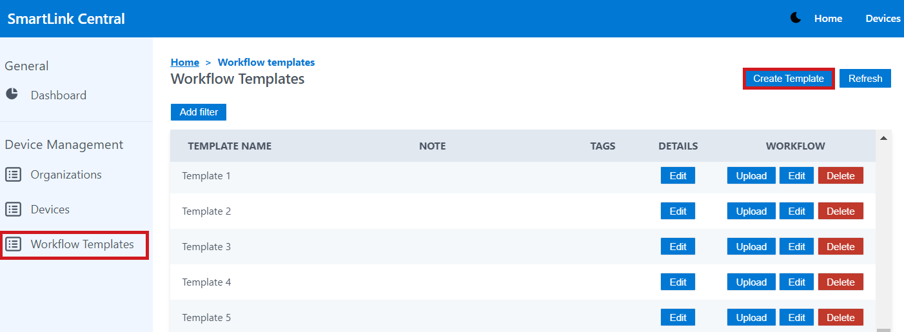
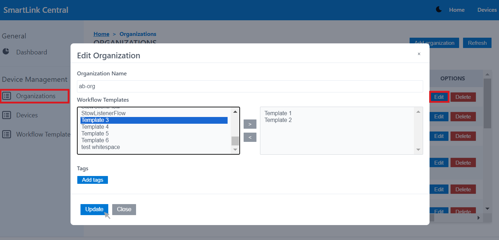
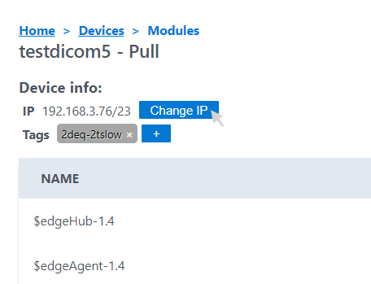
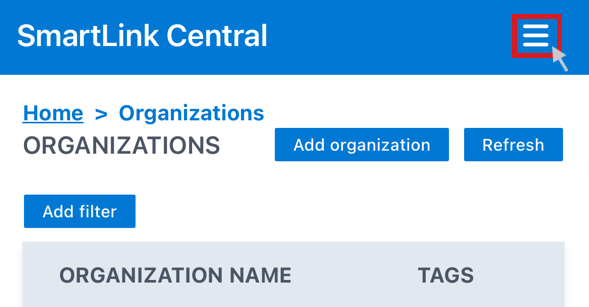
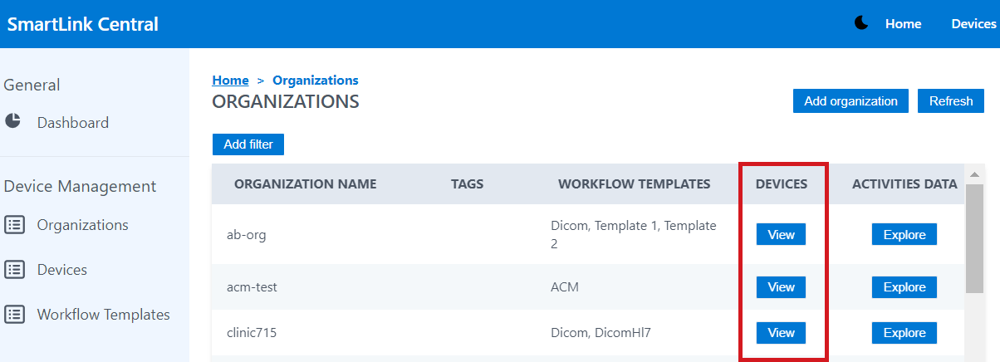

<br/>

# Release Notes

```
Product Name:   Smartlink 5
Version Number: 5.20
Release Date:   May, 2024
```

## Table of Contents

1. [Introduction](#introduction)
2. [New Features](#new-features)
3. [Improvements](#improvements)
4. [Bug Fixes](#bug-fixes)
5. [Deprecations](#deprecations)
6. [Known Issues](#known-issues)
7. [Upcoming Features](#upcoming-features)

## Introduction

Welcome to the May, 2024 release of Smartlink 5. In this update, we've focused on enhancing the user experience to ensure the best performance for our users.

## New Features

### Workflow Templates 

The Workflow Templates tab has been implemented as a section for creating (Create Template button) and editing templates. They can be generated by uploading an existing JSON text (Upload button) or by designing a new workflow structure in the GUI (Edit button). 




Once created, this template must first be associated to the corresponding organization in the Organizations tab (Options-Edit). It can then be added to the device settings (Devices-Settings-Edit-View Templates). 





## Improvements


### IP Change
Enabled the IP change from the module view for devices with Workflowengine version 5.19.0 or higher. If the "smartlinkmanager" module does not exist, the "Change IP" button won't be displayed. If the version is lower than the one indicated, a warning message will appear suggesting the user to upgrade the workflowengine version.



### Mobile friendly Menu
The Smartlink Central menu has been implemented in mobile devices, where the general and device management options are displayed. In previous versions it was displayed as a wide top bar on larger devices and was not displayed on smaller devices.

_Menu Button:_




_Menu displayed:_


### Copy-Paste option for activities
Right-clicking on an activity block displays the “Copy” option. The copied activity can then be pasted into any blank space within the editor by right-clicking and selecting the “Paste” option. 

_Copy:_


_Paste:_


### Devices by Organization
A Devices column has been implemented in the Organizations tab to display devices by organization in the Smartlink Central user interface.





## Bug Fixes

None

## Deprecations

None

## Known Issues

None

## Upcoming Features

None


---

Thank you for being a valued user of Efferent. We hope these updates enhance your experience. For any questions or feedback, please contact our support team at support@efferenthealth.com .