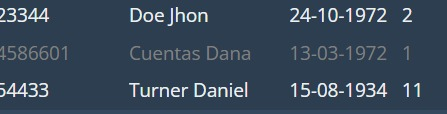
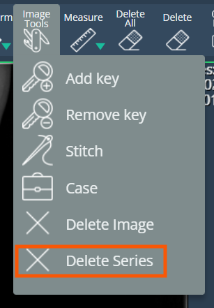
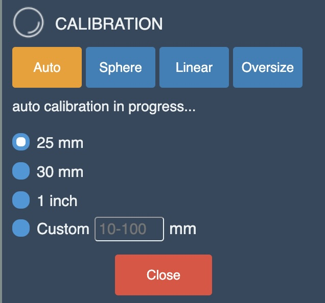
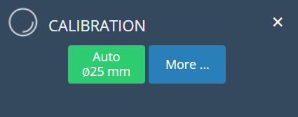
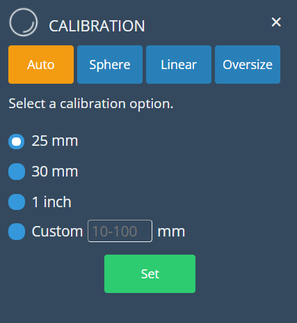
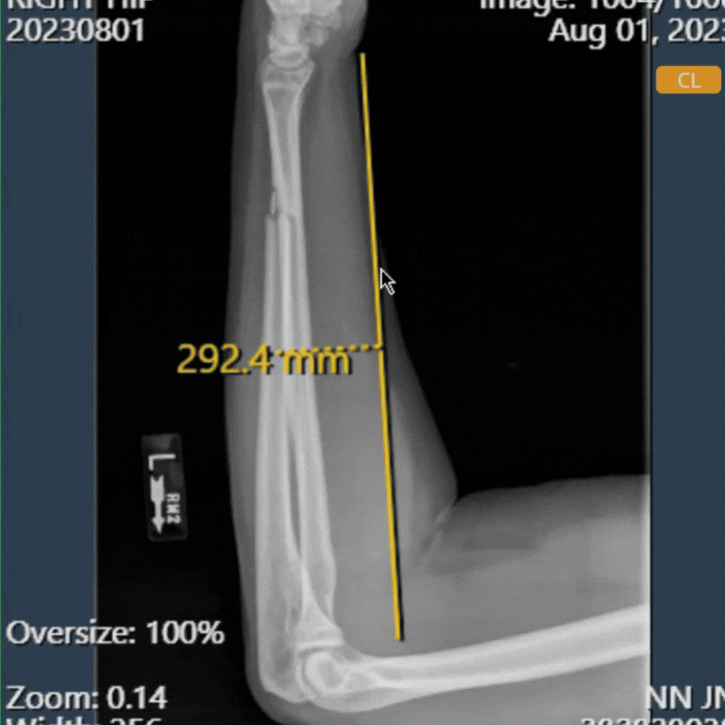
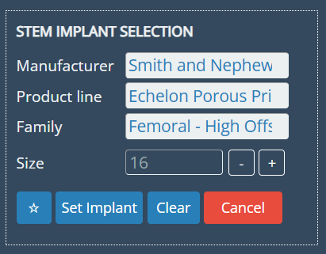
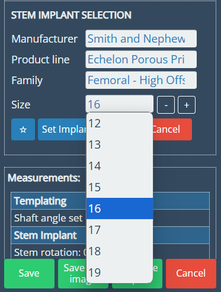

<br/>

# Release Notes

```
Product Name:   eVue and eFit
Version Number: 5.28
Release Date:   January, 2025
```

## Table of Contents

1. [Introduction](#introduction)
2. [New Features](#new-features)
3. [Improvements](#improvements)
4. [Bug Fixes](#bug-fixes)
5. [Deprecations](#deprecations)
6. [Known Issues](#known-issues)
7. [Upcoming Features](#upcoming-features)

## Introduction

Welcome to the January, 2025 release of Efferent eVue and eFit. In this update, we've focused on enhancing the user experience to ensure the best performance for our users.

## New Features

### Archive Feature

A new functionality has been introduced to optimize study management by transferring studies older than seven years to long-term archive. This keeps the worklist focused on recent studies while ensuring historical data remains accessible when needed.



Archived studies will still be visible in the worklist, distinguished by darker gray text. To retrieve an archived study, users can initiate the process with a double-click, triggering a confirmation pop-up. Once restored, a notification email with a direct link to the processed study will be sent, providing seamless access to historical records.


### Deletion of Entire Image Series 

eVue has been enhanced to support the deletion of entire image series, in addition to the previous ability to delete individual images. This improvement simplifies the process, offering users greater flexibility and efficiency in managing image data. The option will be available below the "Delete Image" option in the image tools menu.



## Improvements

### Streamlined Calibration UI

The calibration UI has been streamlined for a more intuitive user experience. Initially, only two buttons are displayed: one for applying the most commonly used option (AUTO) and another labeled "More," which reveals additional calibration options based on user preference. This simplification makes the process faster and easier to navigate while still offering flexibility for more advanced calibration needs.

*_Before:_*



*_After:_*




_By clicking the "more" button:_



### Drag-and-Drop Annotations

Annotations can now be moved easily by dragging them as a whole, allowing for quick and precise repositioning. This improvement streamlines the workflow, saving time and enhancing accuracy.



### Optimized performance for Annotation Addition

The performance of the annotation process has been optimized by eliminating unnecessary messages, resulting in a smoother and more efficient experience.

### Improved Implant Size Selection

The display of implant sizes has been enhanced for a more practical and user-friendly experience. Previously, adjustments were made incrementally using "+" and "-" buttons. Now, a dropdown menu presents all available options, allowing users to quickly and easily choose the desired size.

*_Before:_*



*_After:_*



## Bug Fixes

- **Additional information was displayed in the size field (HIP)**: An issue was identified where additional, unrelated information was displayed in the Size field within the information table. 

## Deprecations

None

## Known Issues

None

## Upcoming Features

None

---

Thank you for being a valued user of Efferent. We hope these updates enhance your experience. For any questions or feedback, please contact our support team at support@efferenthealth.com .