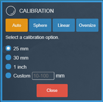
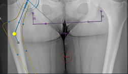
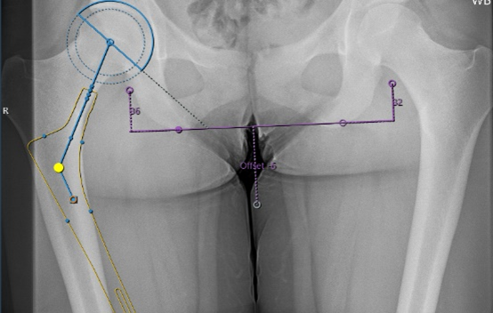

# Monthly Release Notes

- **Product Name:** Efferent eVue and eFit
- **Release Version:** 5.20
- **Release Date:** May, 2024

## Table of Contents

1. [Introduction](#introduction)
2. [New Features](#new-features)
3. [Improvements](#improvements)
4. [Bug Fixes](#bug-fixes)
5. [Deprecations](#deprecations)
6. [Known Issues](#known-issues)
7. [Upcoming Features](#upcoming-features)

## Introduction

Welcome to the May, 2024 release of Efferent eVue and eFit. In this update, we've focused on enhancing user experience _, adding new features, and fixing bugs_ to ensure the best performance for our users.

## New Features

None

## Improvements

### Settings reorganization
Improvements in the display of the settings view tabs. In the imaging study settings view, the tabs are displayed sorted by type of settings.

### Save key image button
A “Save key image” button has been added to the eFit dialog box to generate key images directly. Allows to save designs in the process to continue modifying the current one.

### eFit calibration measurements
The list of eFit automatic calibration measurements is now displayed by clicking Auto. In previous version, when selecting the Auto option, it was assumed to be 25 mm.

### Hip table information
Data on the femoral head implant is now available in the hip table information.  

### Change of laterality
Enabled changing the laterality of the hip implant automatically with the switch option, performing a single run of the AI.

### Clearing calibrations --> new warning message
Improvement when clearing the calibration, so that eFit annotations remain. This facilitates recalibration without discarding the design.

## Bug Fixes

- **Issue**: _Briefly describe the issue and optionally the solution._

## Deprecations

None

## 6. Known Issues

None

## 7. Upcoming Features

### Upcoming Feature 1: [Feature Name]
- **Description**: Briefly describe the upcoming feature.
- **Expected Release**: Mention the expected release timeframe.

---

Thank you for being a valued user of Efferent. We hope these updates enhance your experience. For any questions or feedback, please contact our support team at support@efferenthealth.com .
