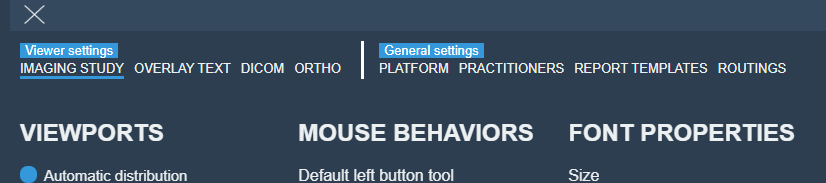
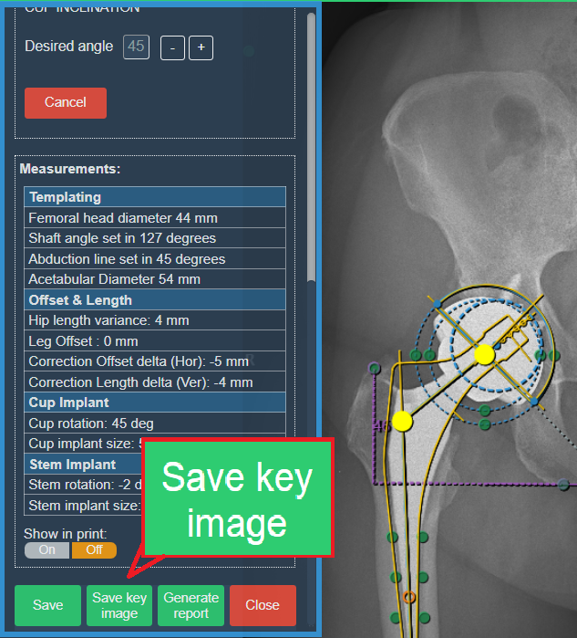
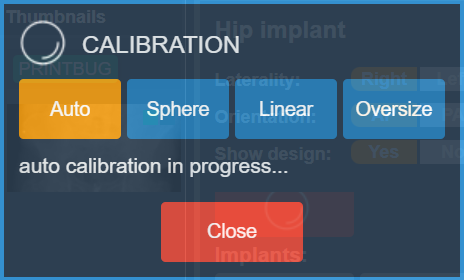
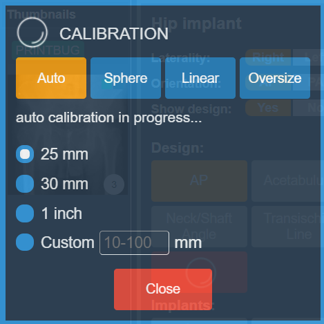
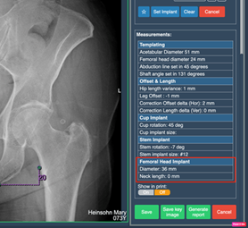
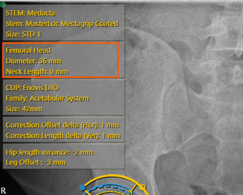
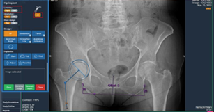
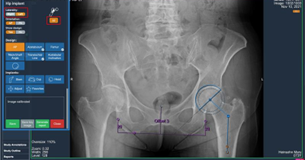
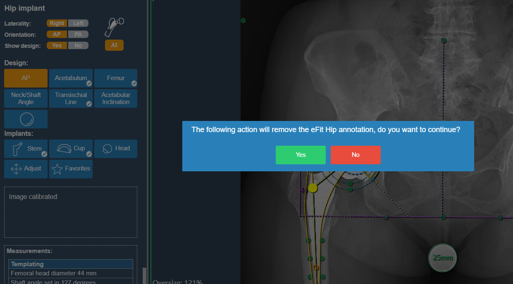

# Release Notes

- Product Name: **eVue and eFit**
- Release Version: **5.20**
- Release Date: **May, 2024**

## Table of Contents

1. [Introduction](#introduction)
2. [New Features](#new-features)
3. [Improvements](#improvements)
4. [Bug Fixes](#bug-fixes)
5. [Deprecations](#deprecations)
6. [Known Issues](#known-issues)
7. [Upcoming Features](#upcoming-features)

## Introduction

Welcome to the May, 2024 release of Efferent eVue and eFit. In this update, we've focused on enhancing user experience _, adding new features, and fixing bugs_ to ensure the best performance for our users.

## New Features

None

## Improvements

### Settings reorganization
Improvements in the display of the settings view tabs. The tabs are now displayed sorted by type of settings in the imaging study settings view, providing better visual organization.

Before:

After:

### Save key image button
A “Save key image” button has been added to the eFit dialog box to generate key images directly. This access allows to save implant options while using the eFit tool and then continue modifying the current one. This speeds up the creation and saving of multiple options, which previously could be done by saving the current implant, closing the efit window and then creating the key image from the image tools.

### eFit calibration measurements
The list of eFit calibration measurements is now also displayed when clicking Auto. In the previous version, selecting the Auto option assumed that it should take a value of 25 mm by default. By adding the list of options, after clicking Auto the user can select the optimal measurement for the study calibration.

Before:

After:

### Hip table information
Data on the femoral head implant is now available in the hip table information.  

### Change of laterality
We enabled changing the laterality of the hip implant automatically with the switch option, performing a single run of the AI algorithm.

### New warning message
This new pop-up message has been added to warn the user not to delete the calibration annotation if it is desired to keep the eFit annotations made. If the user agrees to continue, it will be necessary to recalibrate the image and start adding annotations from scratch.

## Bug Fixes

- **Knee favorite implants issue**: _Knee favorite implants were not displayed in the list of favorite implants in the Ortho settings tab._

## Deprecations

None

## 6. Known Issues

None

## 7. Upcoming Features

### Upcoming Feature 1: [Feature Name]
- **Description**: Briefly describe the upcoming feature.
- **Expected Release**: Mention the expected release timeframe.

---

Thank you for being a valued user of Efferent. We hope these updates enhance your experience. For any questions or feedback, please contact our support team at support@efferenthealth.com .
