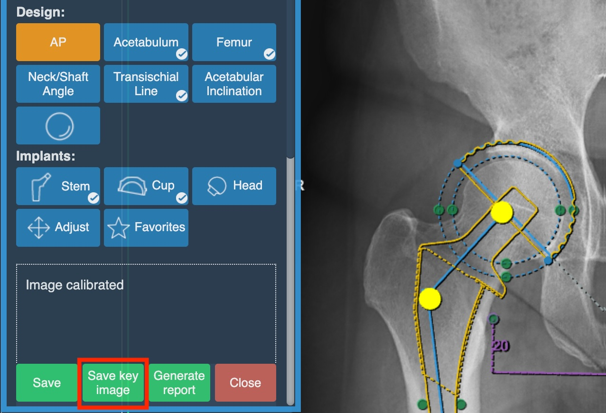
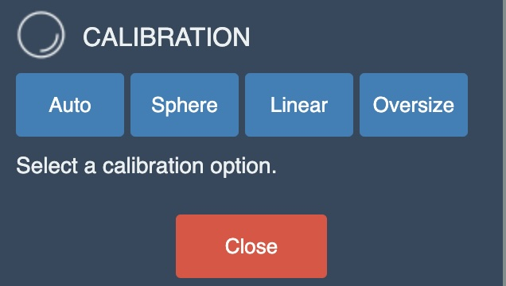
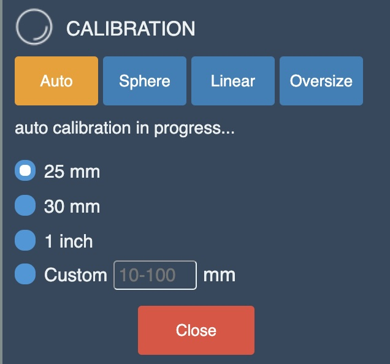
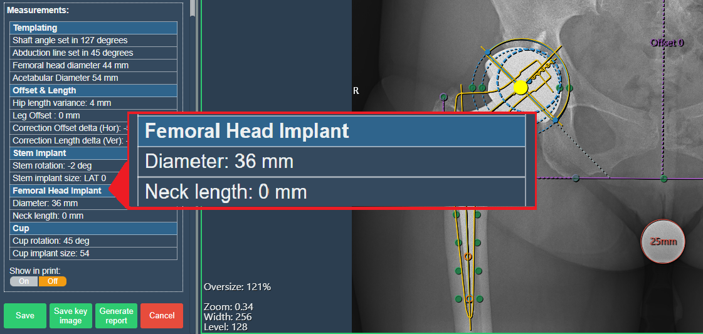
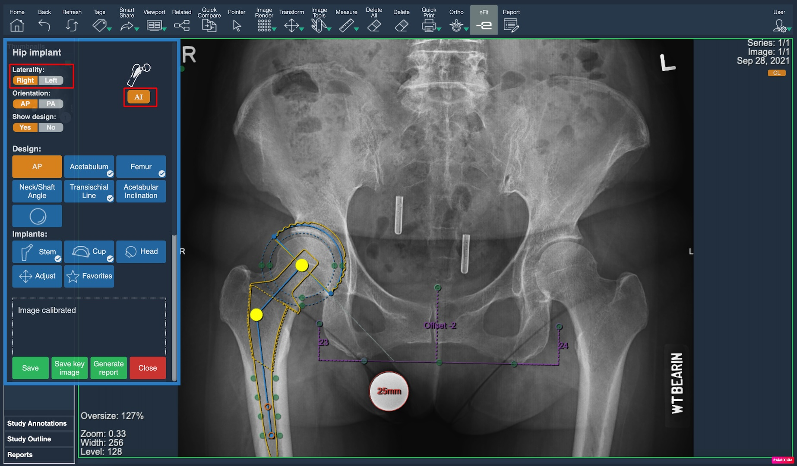
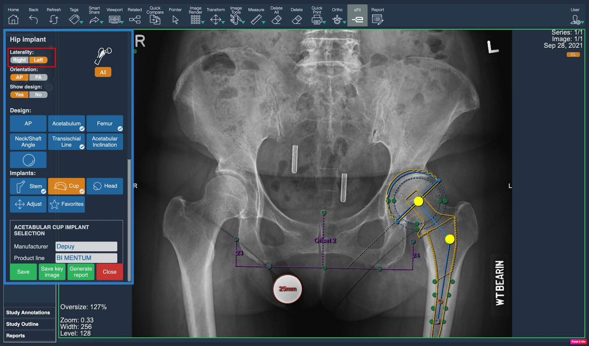
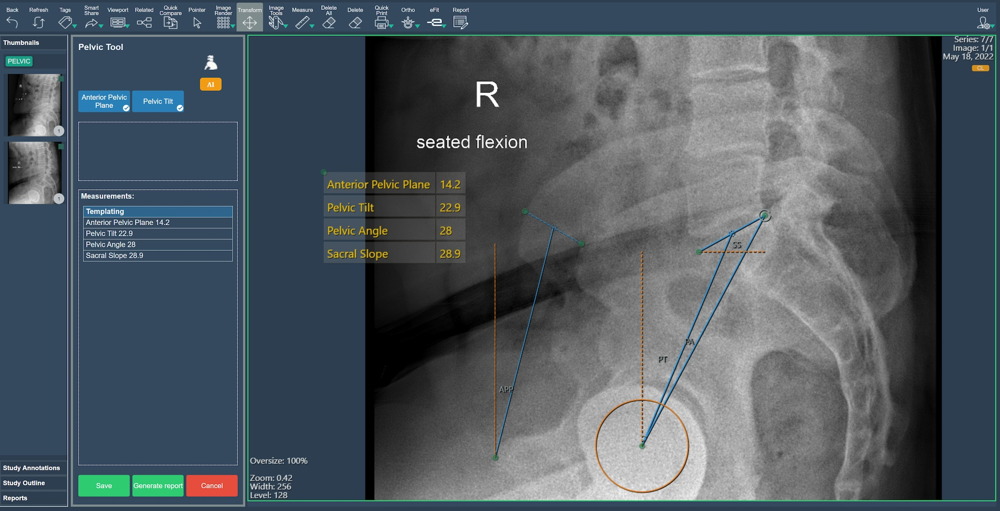
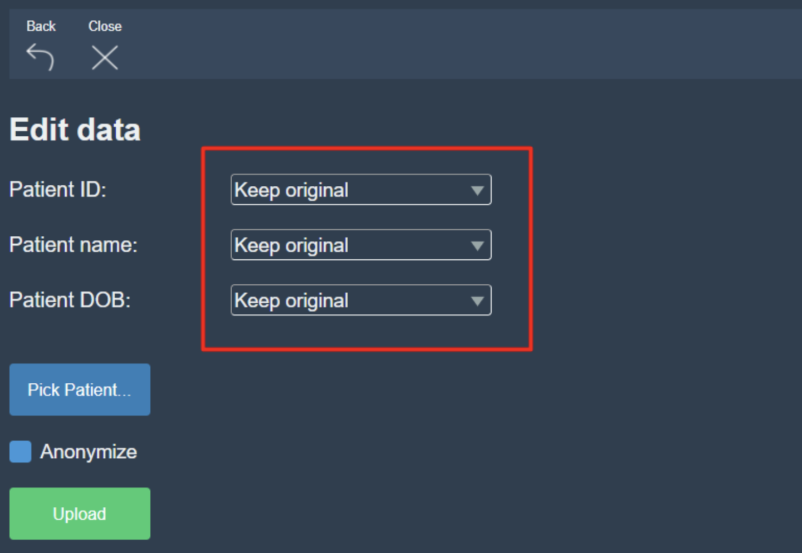

<br/>

# Release Notes

```
Product Name:   eVue and eFit
Version Number: 5.20
Release Date:   May, 2024
```

## Table of Contents

1. [Introduction](#introduction)
2. [New Features](#new-features)
3. [Improvements](#improvements)
4. [Bug Fixes](#bug-fixes)
5. [Deprecations](#deprecations)
6. [Known Issues](#known-issues)
7. [Upcoming Features](#upcoming-features)
8. [Patch Release 5.20.1](#patch-release-5-20-1)

## Introduction

Welcome to the May, 2024 release of Efferent eVue and eFit. In this update, we've focused on enhancing the user experience to ensure the best performance for our users.

## New Features

None

## Improvements

### Settings reorganization
Improvements in the display of the settings view tabs. The tabs are now displayed sorted by type of settings in the imaging study settings view, providing better visual organization.

_Before:_


_After:_


### Save key image button
A "Save key image" button has been added to the eFit dialog boxes to generate key images directly. This access allows to save implant options while using the eFit tool and then continue modifying the current one. 

This speeds up the creation and saving of multiple options, which previously could be done by saving the current implant, closing the efit window and then creating the key image from the image tools.



### eFit calibration measurements
The list of eFit calibration measurements is now also displayed when clicking Auto. In the previous version, selecting the Auto option assumed that it should take a value of 25 mm by default. 

By adding the list of options, after clicking Auto the user can select the optimal measurement for the study calibration.

_Before:_



_After:_



### Hip table information
Data on the femoral head implant are already available in the hip information table and in the “show in print” box.
 
The information of this feature shown in the tables is important as they are measurements that allow the user to visualize the correction values offered by the implant, in a more accurate way. 

_Dialog box:_



_Hip table:_


### Change of laterality
This enhancement allows instantaneous change of the laterality of the hip implant without performing another AI run. 

In the previous version to change this you had to cancel the operation, reopen the eFit dialog and select the desired laterality before running the AI. Now this can be done anytime, using the left and right buttons in the Laterality section.

_Right:_



_Left:_



### New warning message
This new pop-up message has been added to warn the user not to delete the calibration annotation if it is desired to keep the eFit annotations made. 

If the user agrees to continue, it will be necessary to recalibrate the image and start adding annotations from scratch.


## Bug Fixes

- **Knee favorite implants issue**: Knee favorite implants were not displayed in the list of favorite implants in the Ortho settings tab.

## Deprecations

None

## Known Issues

None

## Upcoming Features

### Pelvic tool
- Description: The Pelvic Tool will be an eFit tool used to determine the inclination of the hip (anterior pelvic plane and sacrum) based on anatomical points entered manually or based on detection with an AI algorithm.
- Expected Release: June, 2024.



## Patch Release 5.20.1
A patch was released on May 31, 2024, with the following changes.

### Improvements
- **Upload, keep original**: In the upload option, the edition of demographics allowed three options: empty, select from one of the studies, or replace with custom text. However, it was not possible to keep the original values when the demographics differ among multiple studies. We added a "keep original option", as shown.


### Bug Fixes
- **Cut lines**: In a CT or MRI study, the cut lines didn't synchronize correctly in viewports with a series containing a multiframe image (as opposite to multiple images).

---

Thank you for being a valued user of Efferent. We hope these updates enhance your experience. For any questions or feedback, please contact our support team at support@efferenthealth.com .
