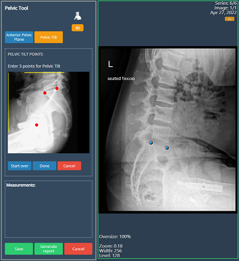
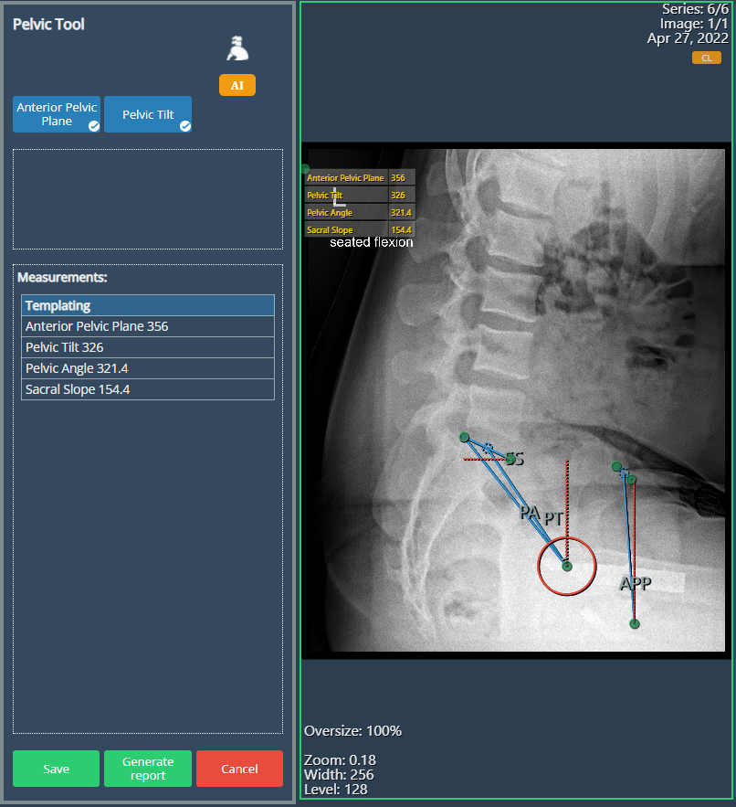
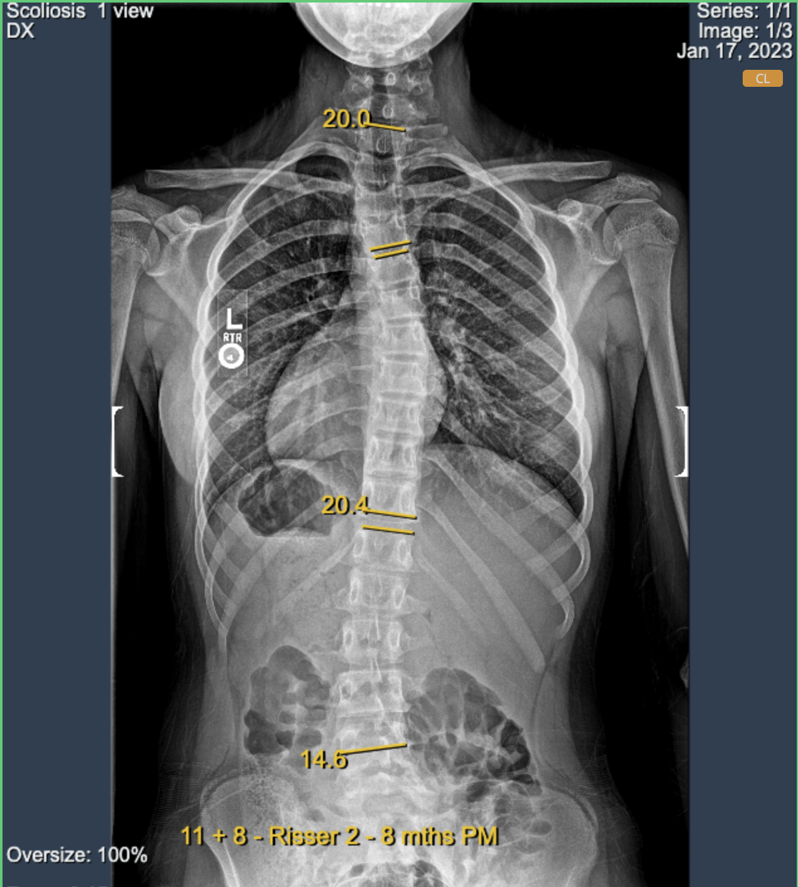
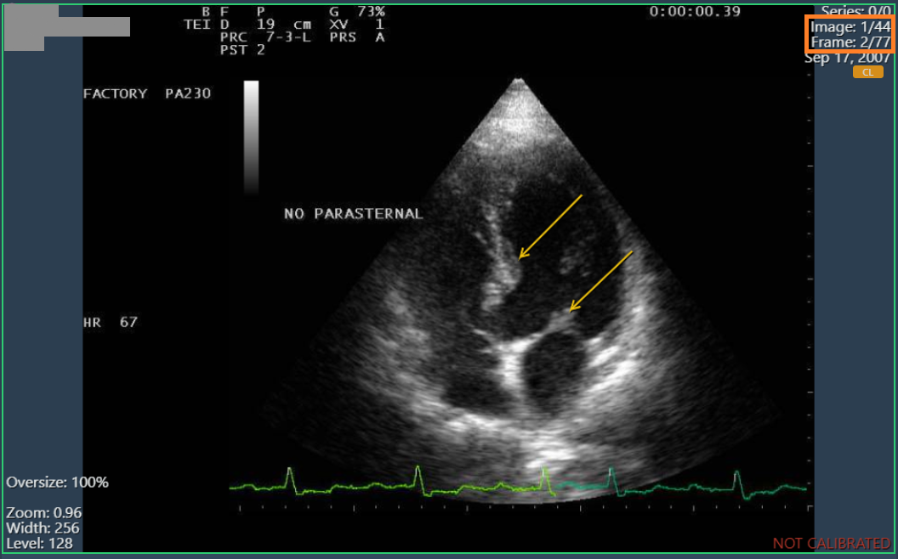
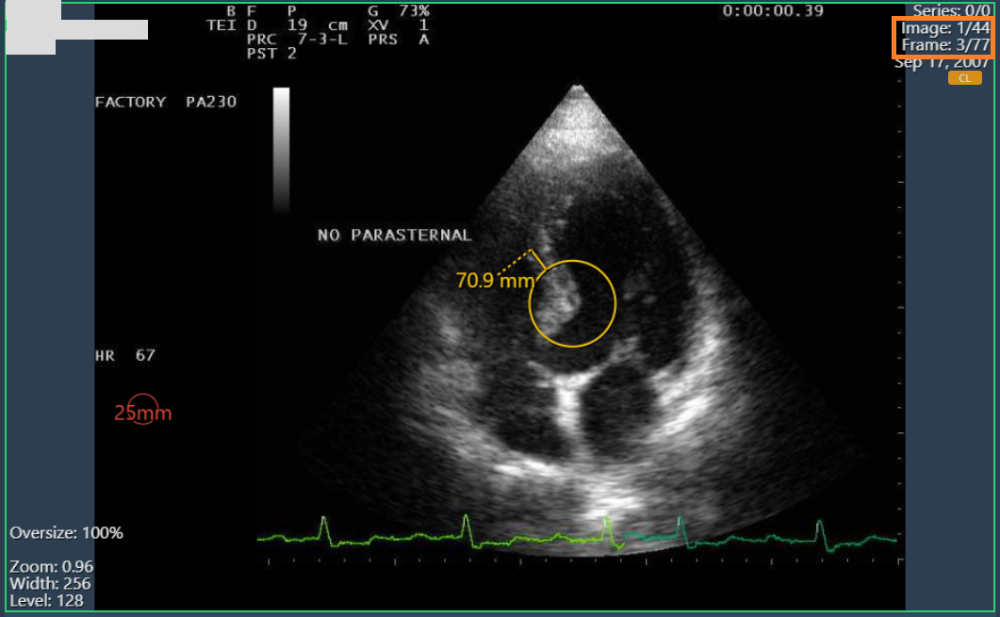
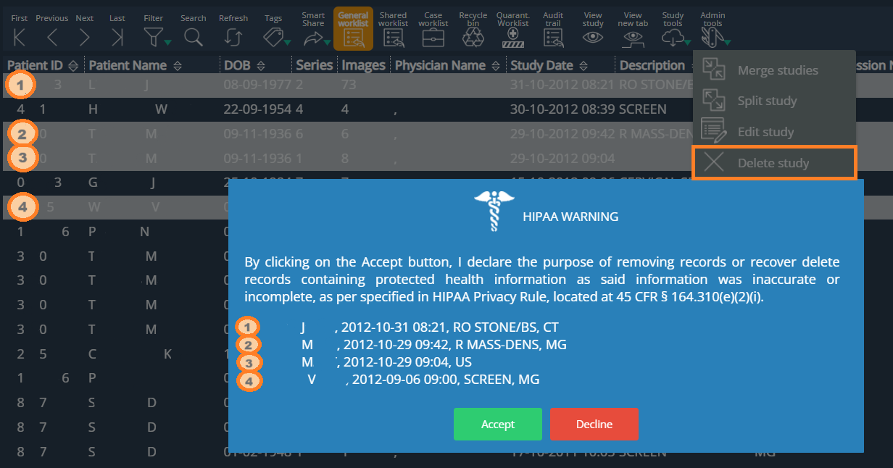
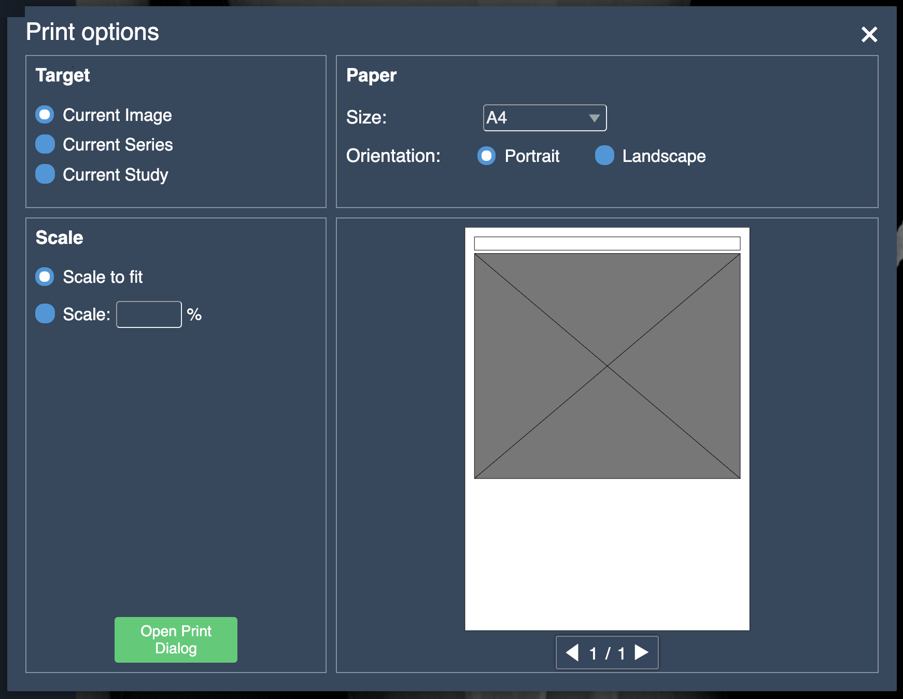
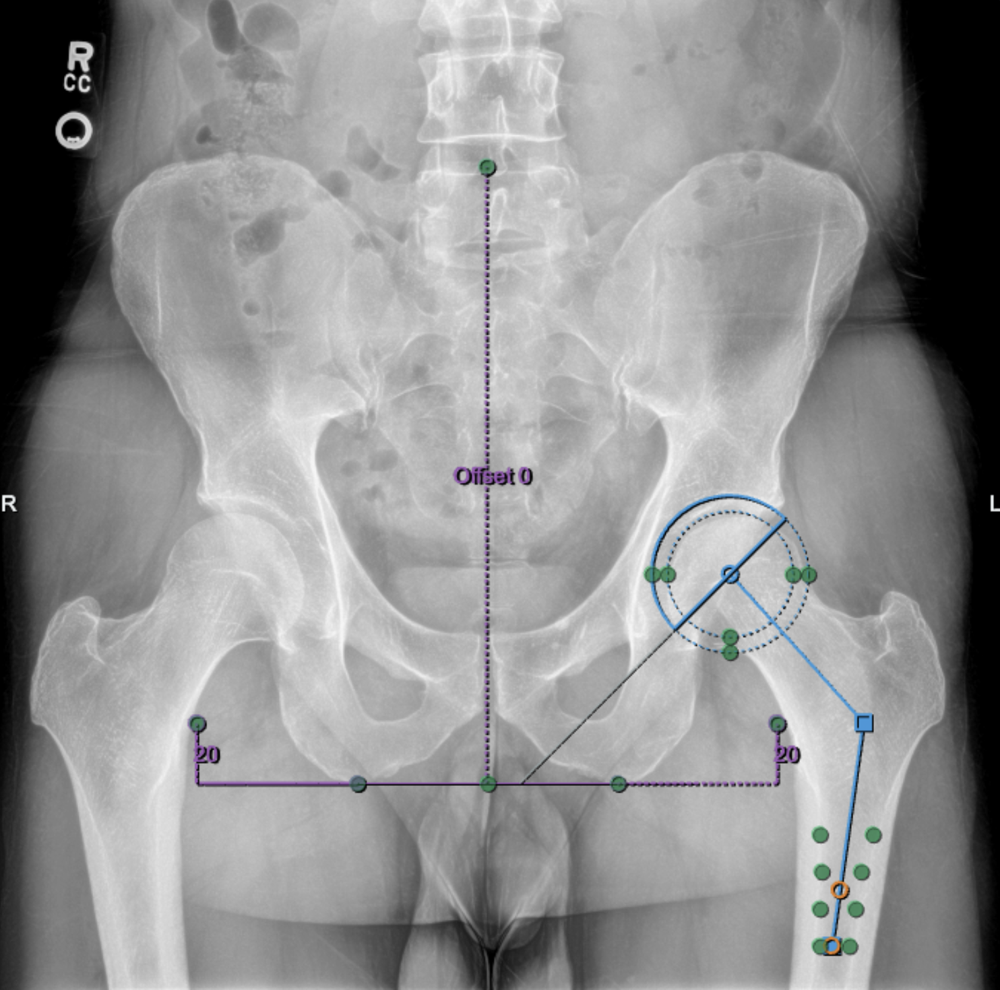

<br/>

# Release Notes

```
Product Name:   eVue and eFit
Version Number: 5.21
Release Date:   June, 2024
```

## Table of Contents

1. [Introduction](#introduction)
2. [New Features](#new-features)
3. [Improvements](#improvements)
4. [Bug Fixes](#bug-fixes)
5. [Deprecations](#deprecations)
6. [Known Issues](#known-issues)
7. [Upcoming Features](#upcoming-features)

## Introduction

Welcome to the June, 2024 release of Efferent eVue and eFit. In this update, we've focused on a couple of new features and enhancing the user experience to ensure the best performance for our users.

## New Features

### Pelvic tool
The Pelvic tool is an eFit tool capable of calculating the inclination of the hip from the lateral view. To get the inclination angle, the user has to set the landmarks of the Anterior Pelvic Plane and the Pelvic Tilt as seen in the images, they can be set manually or with the help an integrated AI algorithm.

_Manual Process drawing points_



_Using the AI Algorithm_



### Support for DICOM graphic annotations (trial)
This enhancement supports the uploading of DICOM files (modality=PR) containing previous annotations. These images can now be displayed in eVue with the annotations from the DICOM.

This feature is still in trial phase and may not show all kind of annotations.



## Improvements

### Column resizing
 It is now possible to edit the width of the columns in the general work list according to the user's preferences, improving the experience of reading the complete information in the columns.


### Annotations on multiframe images
Annotations on multi-frame images were not enabled independently, so they were applied to all frames of an image. Now annotations can be made and displayed on each frame as expected.

_Annotations in frame 2/77_



_Annotations in frame 3/77_



### Soft deletion of several selected studies
The action of deleting more than one selected study at a time has been enabled. This applies to delete studies from the worklist, removing them to the recycle bin.



### Quick Print preview
An image preview has been implemented in the Quick Print options when selecting "current image". Previously this layout was limited to show a gray square instead to represent the scale of the image on the print sheet.

_Before_



_After_


### Autosave for AI in Hip Implant tool

This improvement enables automatic saving of the annotations made with the AI in the hip implant tool, avoiding the loss of changes during the process.

_Adding the first annotations:_


_After closing and reopening the study with unsaved changes:_



## Bug Fixes

- **Thumbnails scroll bar in top and bottom position**: The scrollbar for thumbnails was not displayed when thumbnails were placed horizontally above or below the viewport.

- **Cine for multiframe in High Resolution mode**: Now Cine Mode is not showing empty or flickering when playing cine over high resolution images.

## Deprecations

None

## Known Issues

- Thumbnails for Structured Report (SR) not shown correctly in the Split Study option.

## Upcoming Features

None

---

Thank you for being a valued user of Efferent. We hope these updates enhance your experience. For any questions or feedback, please contact our support team at support@efferenthealth.com .