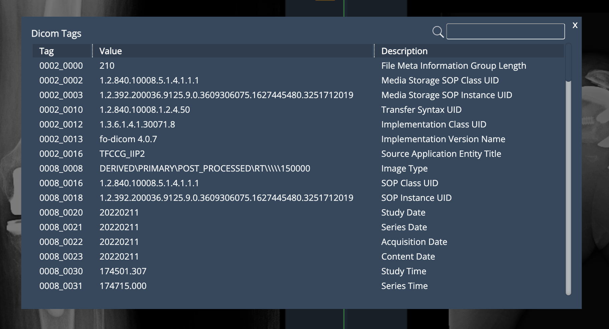
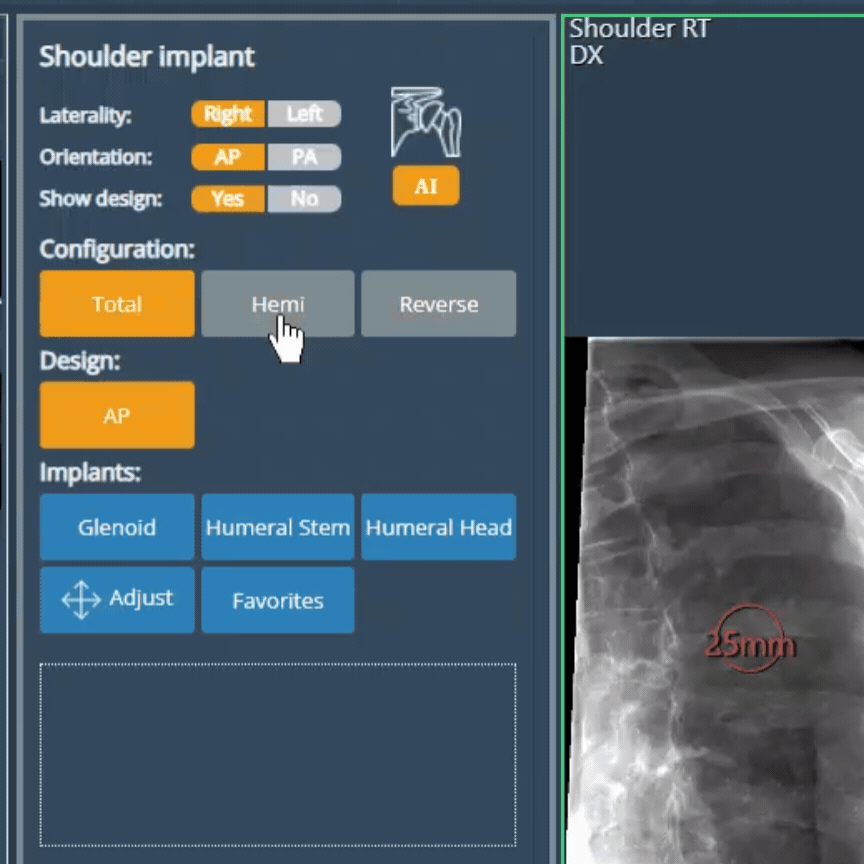

<br/>

# Release Notes

```
Product Name:   eVue and eFit
Version Number: 5.22
Release Date:   July, 2024
```

## Table of Contents

1. [Introduction](#introduction)
2. [New Features](#new-features)
3. [Improvements](#improvements)
4. [Bug Fixes](#bug-fixes)
5. [Deprecations](#deprecations)
6. [Known Issues](#known-issues)
7. [Upcoming Features](#upcoming-features)

## Introduction

Welcome to the July 2024 release of Efferent eVue and eFit. In this update, we've focused on enhancing performance and stability.

## New Features

None

## Improvements

### Search field for DICOM tags

A search field has been added to the DICOM tags list. This will allow the user to have quicker access to specific DICOM tags by filtering by tag number, value, or description.



### Configuration section in shoulder UI

In the eFit shoulder interface, a configuration section has been added that groups sets of implants into three available arthroplasty options:

- **Total:** Includes the components in the arm (Humeral Stem + Humeral Head) and Glenoid.

- **Hemi:** involves implants only for the Humeral Stem + Humeral Head.

- **Reverse:** involves the components in the Humeral Stem + Humeral Head and Glenosphere. The arm component is concave, and the scapula component is convex.



### Logout button in the authorization page

(TODO)

## Bug Fixes

- **The W/L values were not set correctly for CL images**: Multiframe images in CL were not displayed with the correct Window/Level and therefore looked too bright. Some parameters in CL that were being considered as in HD have been corrected. 

- **PR modality icon in the Split view**: When doing a Split, the PR (Presentation State) icon was not displayed correctly in the series display view.

- **Correction in the printing scale for series and complete studies**: The scale factor is now correctly applied when rescaling the images for display in the PDF generated by the quick print function.

- **Correction in scrolling while the magnifier is active**: The magnifier displays only the image on which it was positioned when starting the scrolling action.

## Deprecations

None

## Known Issues

**AI service for Stitch Images:** eFit's AI service does not currently support composite images created using the stitch tool.

## Upcoming Features

**Autosizing - eFit**

A new function that determines the most suitable implant from the user's favorite implants, using anatomical landmarks provided either by the user or the AI.
 
There are two types of users to consider:

- **AI user:** This user leverages Efferent's AI tools and sees this feature as a way to streamline the AI workflow.

- **Non-AI user:** This user manually sets the reference points and may see "auto-sizing" as a way to simplify the process of selecting the right implant combinations.

---

Thank you for being a valued user of Efferent. We hope these updates enhance your experience. For any questions or feedback, please contact our support team at support@efferenthealth.com .