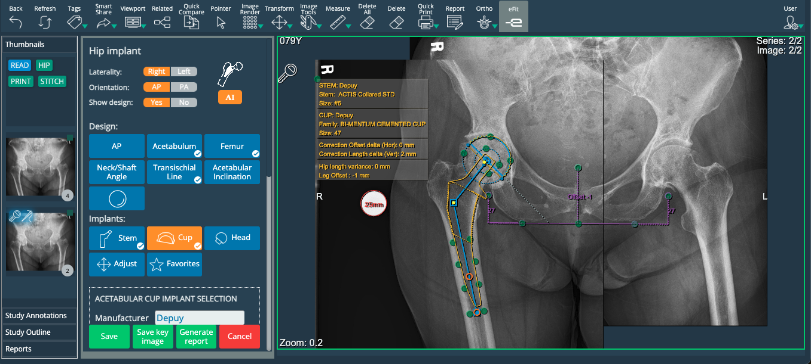
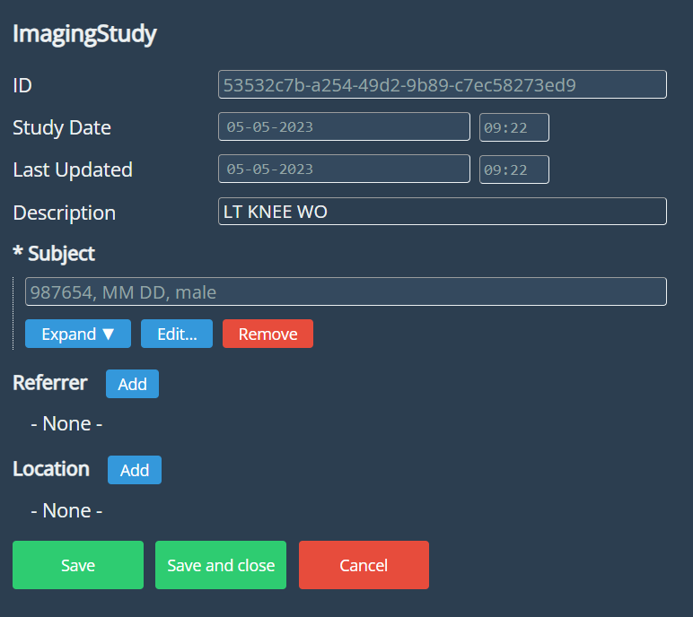
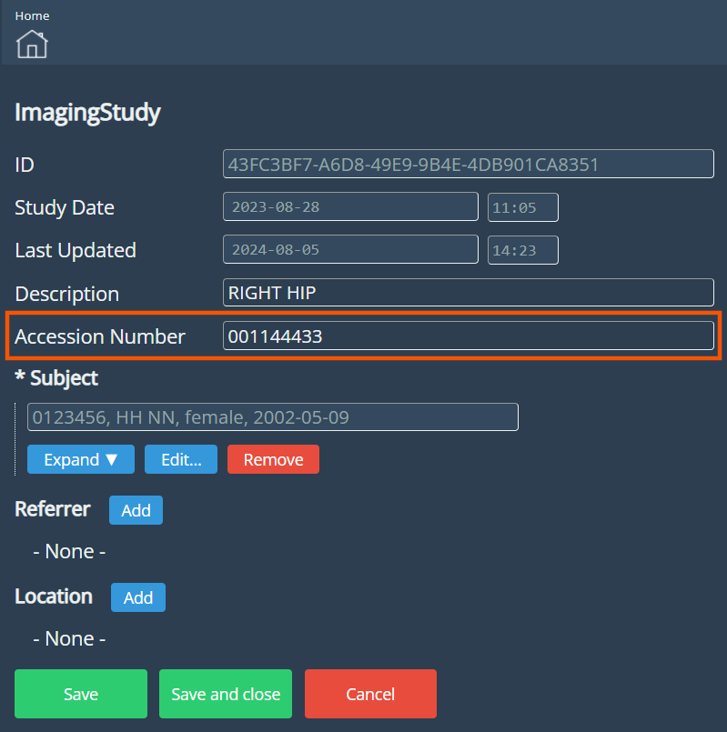
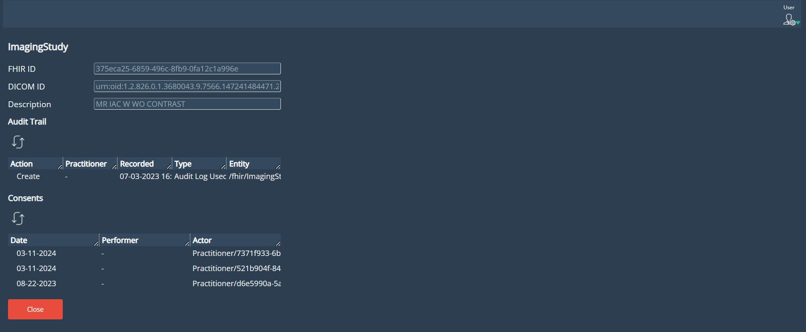
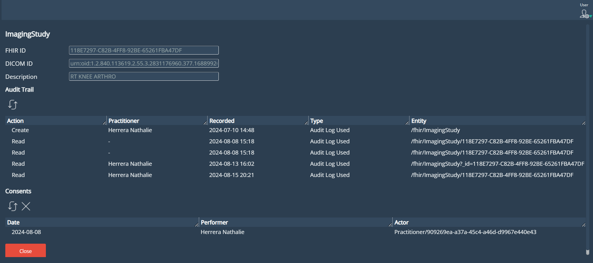
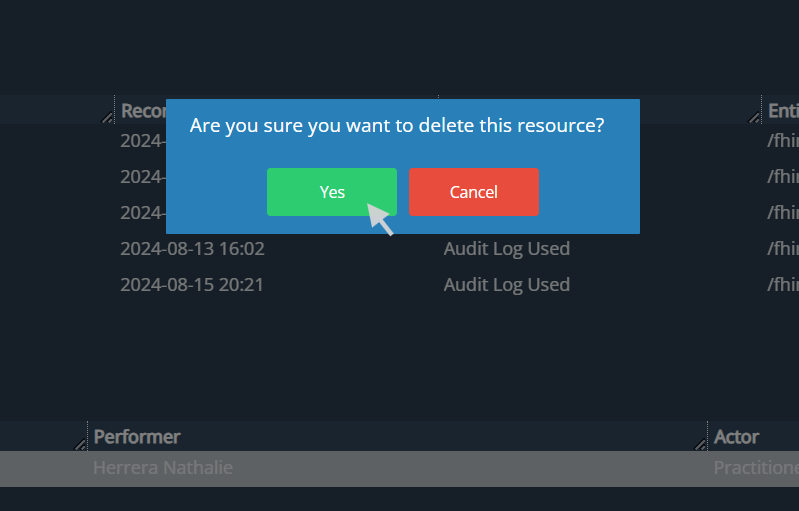
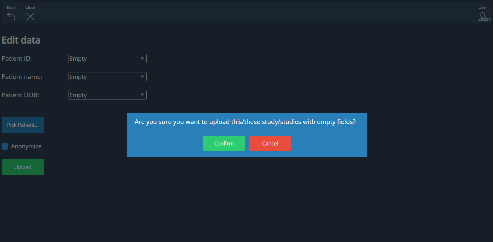
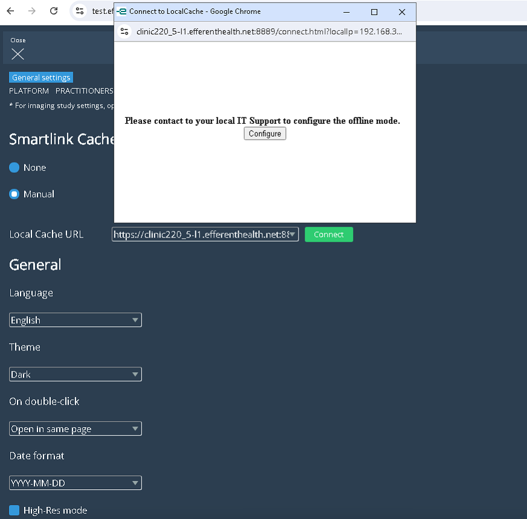

<br/>

# Release Notes

```
Product Name:   eVue and eFit
Version Number: 5.23
Release Date:   August, 2024
```

## Table of Contents

1. [Introduction](#introduction)
2. [New Features](#new-features)
3. [Improvements](#improvements)
4. [Bug Fixes](#bug-fixes)
5. [Deprecations](#deprecations)
6. [Known Issues](#known-issues)
7. [Upcoming Features](#upcoming-features)
8. [Patch Release 5.23.1](#patch-release-5-23-1)

## Introduction

Welcome to the August 2024 release of Efferent eVue and eFit. In this update, we've focused on improving several features.

## New Features

None

## Improvements

### eFit on Stitch images

The Stitch & Resect tool allows to select one or more images from a study to create a composite image. Users have the option to perform cropping and apply basic transformations such as rotation and flip. With this update, it will be possible to conduct eFit planning for the hip on a stitched image using AI and autocalibration services.



### Accession number field in the Imaging Study form

An editable field for the accession number has been added to the Imaging Study form displayed in the study edition view. From now on, when performing a Merge, this data will also be displayed in the new study information.

_Before:_



_After:_



### Inspect view

The presentation of Audit Trail and Consents tables in the Inspect view has been improved, increasing the width of the columns according to the window size.

_Before:_



_After:_



### Delete consents in the Inspect view

Added the option to remove records from the consents list in the Inspect view. Select the record you want to delete and then click on the X next to the refresh symbol button.




### Confirmation dialog  when uploading a Dicom/MP4 without data

Added a message that pops up if the user selects the option “empty” in all patient information fields (PID, Patient Name, DOB) when uploading a Dicom or mp4. The message asks for confirmation to upload the study with all patient data empty. 



### Offline and Hybrid mode for SmartLink 5

#### Hybrid mode: 
eVue shall detect a local SmartLink and retrieve the study images from the SmartLink installed in the same user network, this will increase the downloading experience of the studies by a factor of 5X-7X.
 
#### Offline mode:
In case eVue detects no connection with the Efferent cloud platform, the user will be notified to switch to offline mode. This feature will allow to keep working with the studies stored locally on SmartLink 5.



### Improvement of image rendering

The image rendering has been improved to use a higher quality when showing the entire image on the viewport.

## Bug Fixes

- **Related Studies opened in new tabs**: When opening related studies in a new tab and repeating the process within the newly opened tab successively, some tabs were closed.

- **SmartShare to a guest-patient role**: When sharing studies to a patient who was previously registered as a guest, the user did not have access to the shared study.

## Deprecations

None

## Known Issues

None

## Upcoming Features

None

## Patch Release 5.23.1

A patch was released on August 23, 2024, with the following fix.

- **Imaging Context Menu**: A bug in the display of context menu tools was fixed. The user can now see the options checked in settings, according to his preference, as expected.

---

Thank you for being a valued user of Efferent. We hope these updates enhance your experience. For any questions or feedback, please contact our support team at support@efferenthealth.com .
