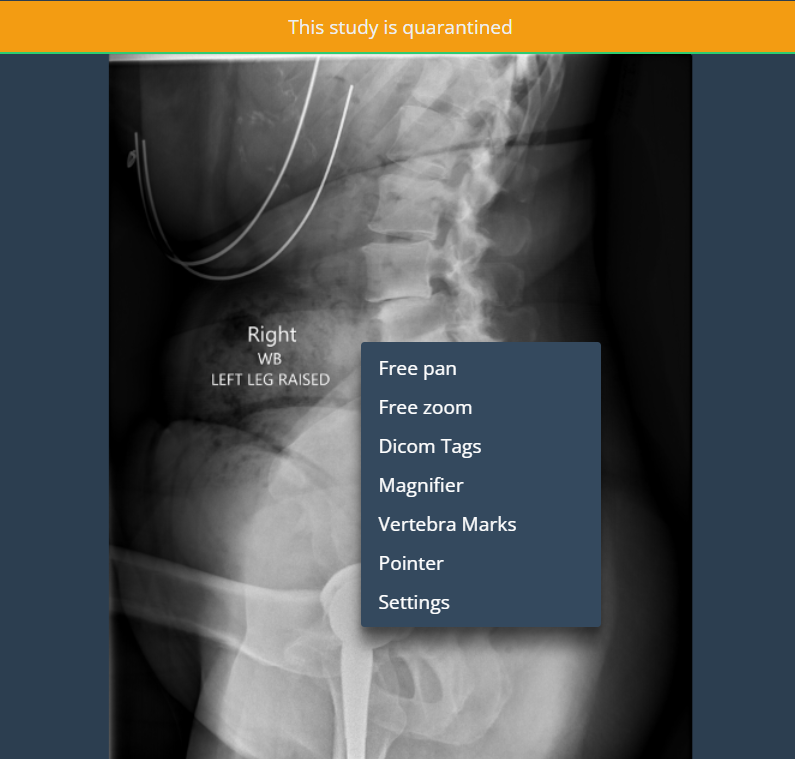
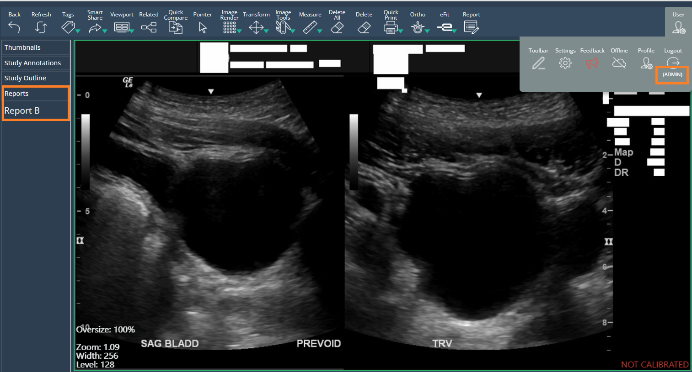
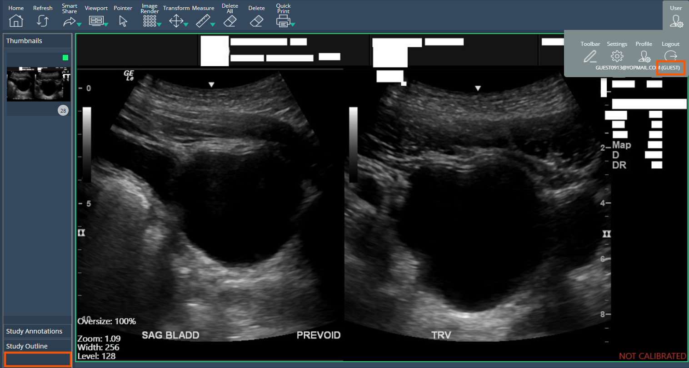

<br/>

# Release Notes

```
Product Name:   eVue and eFit
Version Number: 5.24
Release Date:   September, 2024
```

## Table of Contents

1. [Introduction](#introduction)
2. [Improvements](#improvements)
3. [Bug Fixes](#bug-fixes)
4. [Deprecations](#deprecations)
5. [Known Issues](#known-issues)
6. [Upcoming Features](#upcoming-features)
7. [Patch Release 5.23.1](#patch-release-5231)

## Introduction

Welcome to the September 2024 release of Efferent eVue and eFit. In this update, we've focused on improving features and fixig issues, highlighting the following.

## Improvements

### Implementation of "Auto save" for Knee 

This improvement enables automatic saving of the annotations made with the AI in the knee implant tool, avoiding the loss of changes during the process.

### Context menu available for Quarantine studies

The context menu for studies sent to the quarantine list has been enabled. The user can now have the tools and functionalities defined in settings also in these studies. The context menu will be displayed by right clicking on the viewport.



### Report Permissions

This is a permissions enhancement to increase security. It limits editing, updating, viewing and printing of reports to users with Admin or User role only. Roles such as Patient and Guest will not be able to modify or view them. 





## Bug Fixes

- **Study data displayed too small when printing.** The data from the dicom tags shown on the images was being displayed too small on large images within the preview generated by the print tool. The issue was fixed and the data is now displayed in proportion to the size of the images. 

- **Annotations were not correctly displayed when printing.** Annotations added to images were displaying too small on large images, and some annotation measurements were not being displayed within the preview generated by the print tool. The issue is now fixed and the annotations and their measurements are displayed in the generated dialogue as expected.

- **Extern practitioners access to study annotations** External practitioners (guests) have been limited to view-only access to study annotations. This way only users and admins are allowed to create and modify these annotations.

## Deprecations

None

## Known Issues

None

## Upcoming Features

None

---

Thank you for being a valued user of Efferent. We hope these updates enhance your experience. For any questions or feedback, please contact our support team at support@efferenthealth.com .