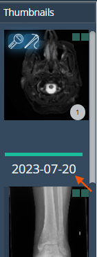
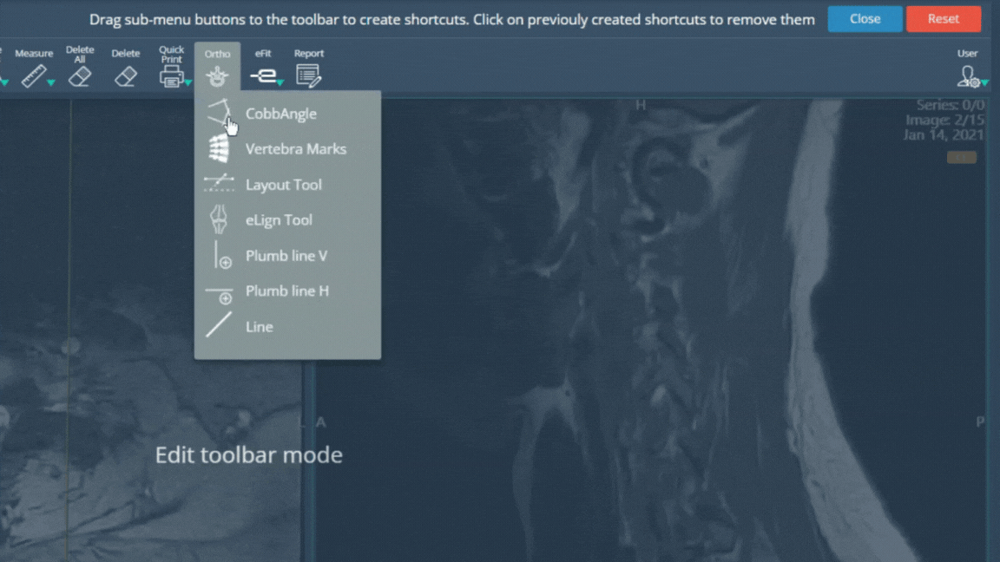
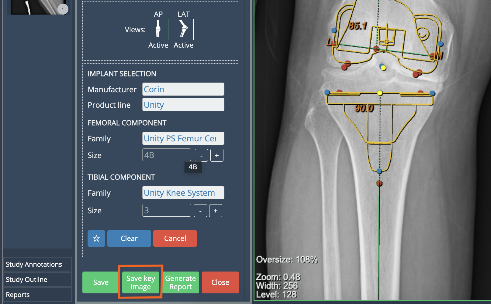

<br/>

# Release Notes

```
Product Name:   eVue and eFit
Version Number: 5.25
Release Date:   October, 2024
```

## Table of Contents

1. [Introduction](#introduction)
2. [Improvements](#improvements)
3. [Bug Fixes](#bug-fixes)
4. [Deprecations](#deprecations)
5. [Known Issues](#known-issues)
6. [Upcoming Features](#upcoming-features)

## Introduction

Welcome to the October 2024 release of Efferent eVue and eFit. In this update, we've focused on improving features, highlighting the following.

## Improvements

### Study date in attached related studies

From this update, related studies attached to the open study will display the date below the green separator bar in the thumbnails, helping users identify the different studies added.



### Shortcuts at the right side of the Toolbar

Functionality shortcuts can now be added to the far right of the toolbar, according to the user's preference.



### HIPAA warning for Dummy guests

The HIPAA warning has been implemented for dummy guests. These users will now be required to accept HIPAA conditions when opening a shared link or QR, protecting shared patient information.

### "Save as key image" option for Knee

The "Save key image" option has been added for knee to generate key images directly. This access allows to save implant options while using the eFit tool and then continue modifying the current one. 

This speeds up the creation and saving of multiple templates, which previously could be done by saving the current implant, closing the efit window and then creating the key image with Image tools.




## Deprecations

None

## Known Issues

None

## Upcoming Features

None

---

Thank you for being a valued user of Efferent. We hope these updates enhance your experience. For any questions or feedback, please contact our support team at support@efferenthealth.com .
