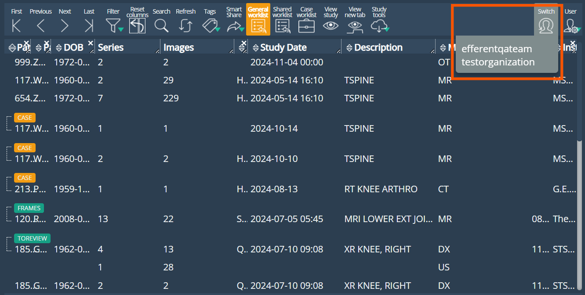
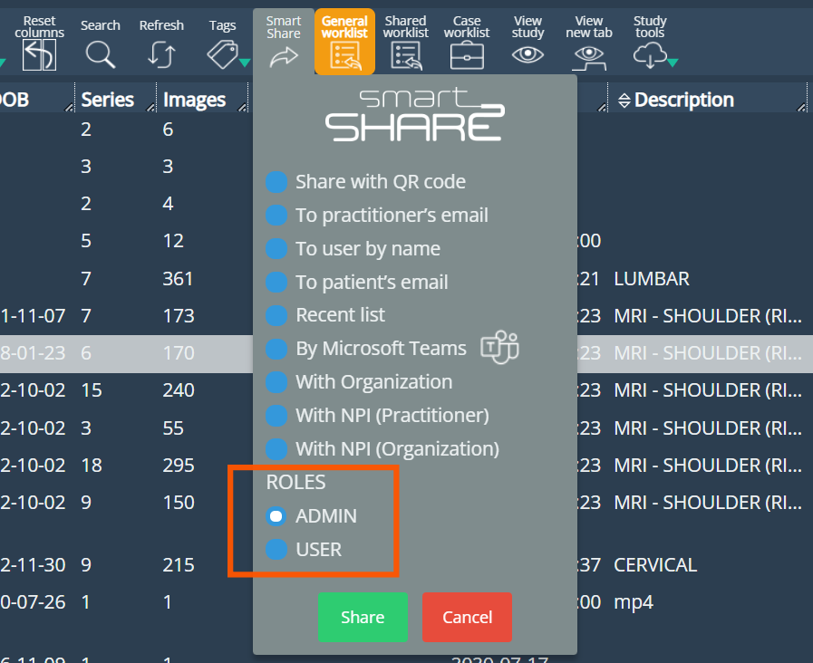
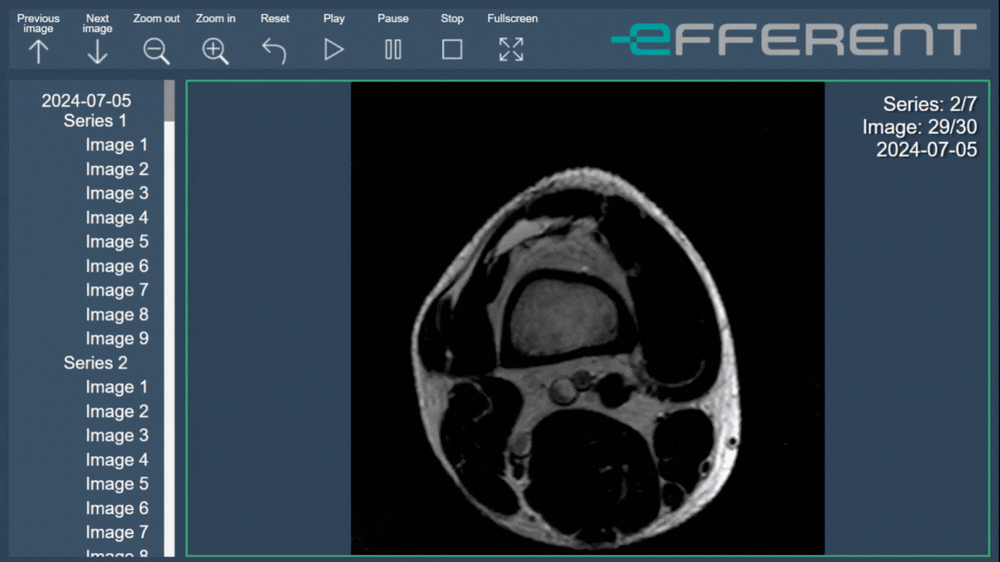

<br/>

# Release Notes

```
Product Name:   eVue and eFit
Version Number: 5.26
Release Date:   October, 2024
```

## Table of Contents

1. [Introduction](#introduction)
2. [Improvements](#improvements)
3. [Bug Fixes](#bug-fixes)
4. [Deprecations](#deprecations)
5. [Known Issues](#known-issues)
6. [Upcoming Features](#upcoming-features)

## Introduction

Welcome to the October 2024 release of Efferent eVue and eFit. In this update, we have focused on providing major process flow improvements and functionality enhancements.

## New Features

### Switch Organization Menu

The new ‘Switch Organization’ drop-down menu has been added which will be visible to those users that are part of more than one organization on the platform. To navigate from one organization to another it is no longer necessary to log out and log back in to a different organization. Instead, click on the "Switch" button next to the user menu and select the organization to switch to.



## Improvements

### Image download speed

Improvement in the download speed of high-resolution studies. Images from large studies can now be viewed with a shorter loading time. The user can manage the download priority of a series by dragging it to the viewport during the process.

### SmartShare with all the users of the same role

Internal practitioners in the organization have been given the option to SmartShare a study with all users of the same role simultaneously.



### Cine tool in the ISO viewer

Automatic playback of images with the Cine tool was enabled in the local viewer, available with the download of a study as an ISO file. In the toolbar the user will find the Play, Pause and stop buttons to use this functionality.



## Bug Fixes

- **The size of the cup (hip) disappeared.** After calibrating the image and running the AI, the cup size disappeared when selecting the cup implant.

- **The drag point of the "Show in print" table disappeared.** The drag point of the "Show in print" information table disappeared after using any transform tool on the image.

## Deprecations

None

## Known Issues

None

## Upcoming Features

None

---

Thank you for being a valued user of Efferent. We hope these updates enhance your experience. For any questions or feedback, please contact our support team at support@efferenthealth.com .